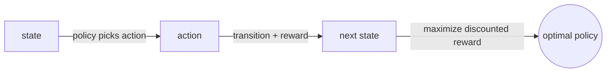
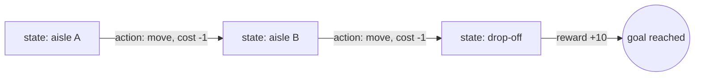
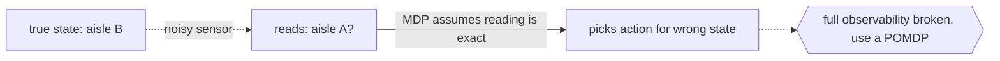

# Markov Decision Process

## Overview

A Markov decision process, or MDP, adds choice to a Markov chain. At each state an agent picks an action, and that action influences which state comes next and what reward is received. Transitions are still Markov: the next state depends only on the current state and the chosen action, not on the past. The agent's goal is to find a policy, a rule mapping states to actions, that maximizes expected cumulative reward over time. This is the standard formal model behind reinforcement learning and planning.

An MDP is defined by states, actions, transition probabilities, a reward function, and a discount factor. The discount factor weights future rewards less than immediate ones, keeping infinite-horizon sums finite and expressing preference for sooner payoffs. Solving an MDP means computing an optimal policy or its value function. Value iteration and policy iteration solve it exactly when the model is known, using the Bellman equations. When the model is unknown, reinforcement learning methods like Q-learning estimate the same quantities from experience.

### Quick Takeaways

- An MDP is a Markov chain plus actions and rewards, so the agent influences its own future
- A policy maps states to actions, and the aim is to maximize expected discounted reward
- The Bellman equation ties the value of a state to the values of the states it can reach

## Definition

- **State** is the current situation of the environment, carrying all information needed for the next decision.
- **Action** is a choice available to the agent that influences the next state and reward.
- **Transition function** gives the probability of the next state given the current state and action.
- **Reward function** gives the scalar payoff received after taking an action in a state.
- **Policy** is a mapping from states to actions, the strategy the agent follows.
- **Discount factor** is a number between zero and one that weights future rewards relative to immediate ones.

## The Analogy

Picture navigating a gridworld to reach treasure. From each square you choose a direction to move. The floor is icy, so choosing to go right might slide you right most of the time but sometimes down. Each step costs a little, and the treasure square gives a big reward. You want a rule that says, from any square, which direction to try, so that over many attempts you collect the most reward. That rule is the policy, and the icy slipping is the stochastic transition function.

## When You See It

- Reinforcement learning where an agent learns optimal behavior in a known or learned environment
- Robotics planning where a robot chooses actions to reach a goal under uncertainty
- Inventory and supply chain control deciding how much to reorder in each state of stock
- Game playing where each move leads probabilistically to new game states with rewards
- Resource scheduling choosing how to allocate compute or bandwidth over time
- Autonomous driving policies selecting maneuvers that trade off progress against safety

## Examples

**Good:** Modeling a delivery robot in a warehouse as an MDP with states for location, actions for movement, small step costs, and a reward for reaching the drop-off. Value iteration yields a clear optimal route policy.

**Bad:** Using an MDP when the agent cannot actually observe its true state, only noisy sensors. The full observability assumption is violated and a POMDP is needed instead.

**Good:** Framing inventory control as an MDP where states are stock levels, actions are reorder amounts, and rewards balance holding cost against stockout penalty. The optimal policy gives a reorder rule per stock level.

**Bad:** Setting the discount factor to exactly one in an infinite-horizon problem. Cumulative reward can diverge and the value function becomes ill-defined.

## Important Points

- The Markov property applies to state-action pairs, the next state depends only on the current state and action
- The Bellman optimality equation is the fixed point that value iteration and policy iteration converge to
- Value iteration repeatedly updates state values, policy iteration alternates evaluation and improvement
- The discount factor trades off short-term versus long-term reward and ensures convergence
- When transitions and rewards are unknown, reinforcement learning estimates them from sampled experience
- The state must be defined so it truly captures all information relevant to future outcomes
- MDPs assume full observability, which distinguishes them from partially observable variants

## Summary

- An MDP formalizes sequential decision making with states, actions, transitions, and rewards.
- The agent seeks a policy that maximizes expected discounted cumulative reward.
- Bellman equations connect state values and are solved by value or policy iteration.
- It is the mathematical backbone of reinforcement learning and planning under uncertainty.
- The full observability assumption is its key boundary, relaxed by the POMDP.
- _You do not just watch the chain move, you steer it, and rewards tell you how well you steered._
