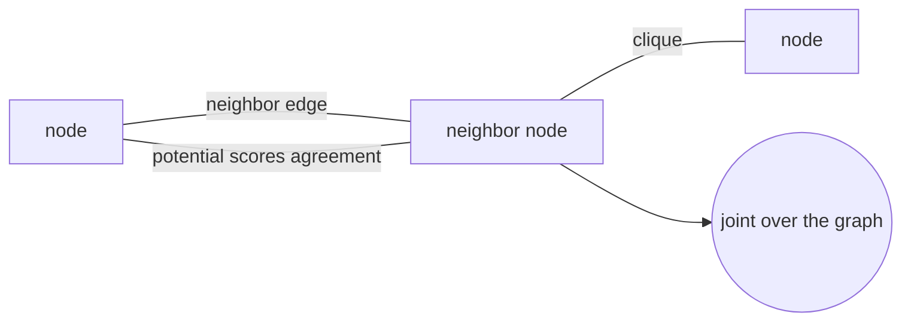
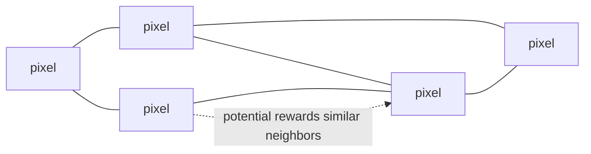
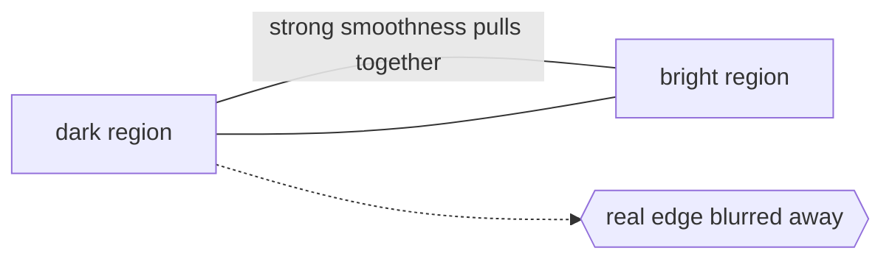

# Markov Random Field

## Overview

A Markov random field, or MRF, moves the Markov idea from a line into a graph. Instead of a sequence in time, you have a set of variables arranged as nodes in an undirected graph. The Markov property here is local: each variable is conditionally independent of all others given its immediate neighbors. Knowing your neighbors screens off the rest of the network. This makes MRFs the natural tool for spatial data, like pixels in an image, where each element is influenced by the ones next to it.

An MRF defines a joint probability over all variables using potential functions on cliques, groups of mutually connected nodes. By the Hammersley-Clifford theorem the joint distribution factorizes as a product of these clique potentials, normalized by a partition function. Unlike Bayesian networks, MRFs are undirected, so they express symmetric relationships without a notion of cause and effect. The catch is the partition function, which sums over all configurations and is usually intractable, forcing approximate inference. MRFs underpin image denoising, segmentation, and many computer vision tasks.

### Quick Takeaways

- Variables sit on an undirected graph and each depends only on its immediate neighbors
- The joint distribution factorizes into potential functions over cliques of connected nodes
- The normalizing partition function is usually intractable, so inference is approximate

## Definition

- **Node** is a random variable in the graph, such as the label of a single pixel.
- **Edge** is an undirected link expressing a direct dependency between two variables.
- **Neighborhood** is the set of nodes directly connected to a given node by edges.
- **Clique** is a set of nodes that are all mutually connected to each other.
- **Potential function** is a non-negative function over a clique that scores how compatible its values are.
- **Partition function** is the normalizing constant that sums the unnormalized scores over all configurations.

## The Analogy

Picture a crowd deciding whether to stand or sit at a stadium. Each person mostly copies the people right next to them because standing alone looks odd. Nobody consults the far side of the arena, only their immediate neighbors. The overall pattern of standing and sitting sections emerges from these purely local agreements. That is an MRF: each person is a node, the local copying is a potential favoring agreement with neighbors, and the resulting wave pattern is a high-probability configuration.

## When You See It

- Image denoising where each pixel is encouraged to agree with its neighbors
- Image segmentation labeling regions so nearby pixels tend to share a label
- Stereo vision and depth estimation smoothing depth across neighboring pixels
- Texture modeling and synthesis capturing local spatial regularities
- Spatial statistics modeling correlated measurements over a geographic grid
- Conditional random fields for labeling sequences and structured prediction

## Examples

**Good:** Using an MRF for image denoising with potentials that reward neighboring pixels having similar intensities. This smooths out random noise while preserving broad structure.

**Bad:** Applying a strong smoothness MRF to an image with sharp, meaningful edges. Over-smoothing blurs the real boundaries the pixels were supposed to preserve.

**Good:** Modeling land-cover segmentation where adjacent map cells are likely to share a category. The neighbor potentials produce contiguous, realistic regions rather than speckle.

**Bad:** Expecting an MRF to capture a long-range global constraint through purely local potentials. Local interactions cannot directly enforce a property that spans the entire graph.

## Important Points

- The local Markov property means a node is independent of the rest given its neighbors
- Hammersley-Clifford guarantees the factorization into clique potentials for positive distributions
- MRFs are undirected, expressing symmetric relations without direction of causality
- The partition function normalizes the distribution but is typically intractable to compute exactly
- Inference relies on approximations like belief propagation, graph cuts, or MCMC sampling
- Conditional random fields are the discriminative cousin, modeling labels conditioned on inputs
- The graph structure encodes prior beliefs about which variables directly interact

## Summary

- An MRF places variables on an undirected graph where each depends only on its neighbors.
- The joint distribution factorizes into potential functions over cliques.
- It naturally models spatial and relational structure like pixels in an image.
- The intractable partition function forces reliance on approximate inference.
- Being undirected, it captures symmetric dependencies rather than cause and effect.
- _Each node only listens to its neighbors, yet a global pattern emerges from the whispering._
