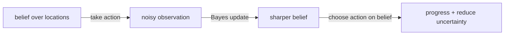
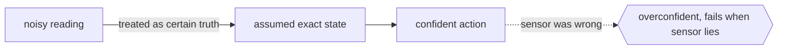

# Partially Observable Markov Decision Process

## Overview

A partially observable Markov decision process, or POMDP, is an MDP where the agent cannot directly see the true state. Instead it receives observations that are noisy or incomplete clues about the state. This combines the decision and reward structure of an MDP with the hidden-state structure of a hidden Markov model. The agent must choose actions while uncertain about where it actually is. This matches most real-world robotics and control, where sensors are imperfect and the world is only partly visible.

Because the true state is hidden, a POMDP agent maintains a belief state, a probability distribution over all possible states. After each action and observation, it updates this belief using Bayes' rule. The optimal policy maps beliefs, not states, to actions. This makes POMDPs far harder to solve than MDPs, because the belief space is continuous even when states are discrete. Exact solutions are intractable for all but tiny problems, so practitioners rely on approximate and point-based methods. The reward for this difficulty is a principled way to act under genuine uncertainty.

### Quick Takeaways

- The agent cannot see the true state and only receives noisy observations of it
- It maintains a belief, a probability distribution over states, updated by Bayes' rule
- The optimal policy maps beliefs to actions, which makes POMDPs much harder than MDPs

## Definition

- **Hidden state** is the true underlying state of the environment that the agent cannot observe directly.
- **Observation** is the imperfect signal the agent receives, related to the hidden state by an observation model.
- **Observation model** gives the probability of an observation given the true state and action.
- **Belief state** is a probability distribution over all possible states, summarizing everything the agent knows.
- **Belief update** is the Bayesian revision of the belief after taking an action and receiving an observation.
- **Policy** in a POMDP maps belief states, rather than true states, to actions.

## The Analogy

Imagine finding your way through a dark house with only your hands. You cannot see which room you are in, but touching a smooth wall, a doorframe, or carpet gives hints. You keep a mental sense of "I am probably in the hallway, maybe the kitchen" and update it with every touch and step. You decide where to move based on that shifting sense of location, not on certain knowledge. That evolving mental estimate is the belief state, and acting on it despite uncertainty is the POMDP problem.

## When You See It

- Robot navigation with noisy sensors where the true position is never certain
- Dialogue systems inferring hidden user intent from ambiguous utterances
- Medical treatment planning where the true disease state is inferred from tests
- Autonomous driving under occlusion where other agents are only partially visible
- Spoken language and gesture interfaces that must act on uncertain recognition
- Search and rescue where a robot must localize while exploring an unknown map

## Examples

**Good:** Modeling a vacuum robot with unreliable position sensors as a POMDP. It maintains a belief over locations and chooses moves that both make progress and reduce positional uncertainty.

**Bad:** Treating that same robot as a plain MDP by pretending its noisy sensor reading is the true state. The agent acts overconfidently and fails whenever the sensor lies.

**Good:** Using a POMDP for a dialogue agent where the hidden user intent is inferred from utterances. The belief over intents lets it ask clarifying questions when uncertain.

**Bad:** Trying to solve a large POMDP with an exact algorithm over the full belief space. The continuous, high-dimensional belief space makes exact planning computationally hopeless.

## Important Points

- A POMDP is an MDP plus an observation model that hides the true state behind noisy signals
- The belief state is a sufficient statistic, capturing all history relevant to optimal action
- Belief updates use Bayes' rule combining the transition model and the observation model
- The optimal value function over belief space is piecewise linear and convex for finite horizons
- Exact solutions scale terribly, so point-based and online methods approximate the policy
- Actions can serve two purposes, gaining reward and gathering information to sharpen the belief
- POMDPs unify HMM-style hidden states with MDP-style decision making under one framework

## Summary

- A POMDP is an MDP where the true state is hidden behind noisy observations.
- The agent tracks a belief distribution over states and updates it with Bayes' rule.
- Optimal policies map beliefs to actions, making the problem far harder than an MDP.
- Actions may be chosen to reduce uncertainty as well as to earn reward.
- Exact solving is intractable at scale, so approximate methods dominate in practice.
- _You cannot see the room, so you act on your best guess and refine it with every touch._
