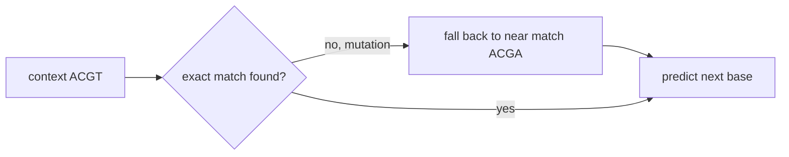
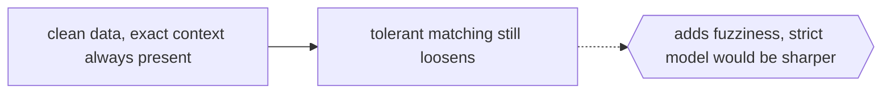

# Tolerant Markov Model

## Overview

A tolerant Markov model, or TMM, is a probabilistic-algorithmic Markov model built to tolerate noise and unseen contexts. A strict Markov model conditions the next symbol on an exact preceding context. If that exact context never appeared in training, or the input is slightly corrupted, the model has no prediction to offer. A TMM relaxes this rigidity. It allows approximate or partial matches on the conditioning context, so it can still make a sensible prediction when the exact history is missing or noisy.

This tolerance is valuable in domains where data is imperfect or highly varied, such as bioinformatics sequences and data compression. By not demanding an exact context match, a TMM degrades gracefully instead of failing outright on novel input. It sits between rigid fixed-order Markov models and more flexible variable-order approaches, trading a little precision for robustness. The core idea is simple: prefer a slightly looser but available prediction over an exact but impossible one.

### Quick Takeaways

- A TMM relaxes exact context matching so it still predicts under noise or unseen histories
- It degrades gracefully instead of failing when the precise preceding context is missing
- It trades a little precision for robustness, useful in noisy domains like bioinformatics

## Definition

- **Context** is the sequence of recent symbols used to condition the prediction of the next symbol.
- **Strict matching** is requiring the current context to exactly equal a context seen during training.
- **Tolerant matching** is accepting approximate or partial contexts when no exact match exists.
- **Fallback** is the mechanism of backing off to a shorter or looser context to keep predicting.
- **Noise tolerance** is the ability to produce reasonable predictions despite corrupted input.
- **Prediction** is the probability distribution over the next symbol given the tolerated context.

## The Analogy

Think of understanding someone with a heavy accent or a bad phone connection. If you insisted on hearing every word perfectly, you would be lost the moment one syllable dropped. Instead you match what you hear to the closest familiar phrase and keep the conversation going. You tolerate imperfect input and still extract meaning. A tolerant Markov model does exactly this: when the exact context is garbled or unseen, it settles for the closest usable one and still makes a prediction.

## When You See It

- Bioinformatics modeling DNA or protein sequences that contain mutations and noise
- Data compression where robustness to varied input improves overall coding
- Text prediction on noisy or informal input with typos and unseen combinations
- Anomaly detection where inputs often differ from any exact training context
- Sequence modeling in domains with high variability and sparse exact repeats
- Any setting where strict fixed-order Markov models fail on novel contexts

## Examples

**Good:** Using a TMM on DNA sequences where point mutations mean an exact k-mer context may never recur. Tolerant matching lets it still predict the next base from a near-match context.

**Bad:** Using a TMM where the domain is clean and exact contexts always recur. The tolerance adds fuzziness with no benefit, and a strict model would be more precise.

**Good:** Applying a TMM in a compression pipeline over heterogeneous input, so rare or slightly novel contexts still yield useful predictions instead of gaps.

**Bad:** Cranking tolerance so high that very different contexts are treated as equivalent. Predictions become vague and the model loses the discriminative power that makes it useful.

## Important Points

- The defining feature is tolerance of noise and unseen contexts rather than exact matching
- It combines probabilistic prediction with algorithmic fallback to looser contexts
- Tolerance is a dial, too little is brittle and too much is imprecise
- It is well suited to bioinformatics and compression where exact contexts are unreliable
- It relates to variable-order and back-off Markov models that also relax fixed context length
- The benefit is graceful degradation, the cost is some loss of predictive sharpness
- Choosing the matching and fallback strategy is the key design decision

## Summary

- A tolerant Markov model relaxes strict context matching to handle noise and unseen histories.
- It falls back to approximate or shorter contexts instead of failing outright.
- This makes it robust in noisy domains like bioinformatics and data compression.
- Tolerance is a tunable tradeoff between robustness and predictive precision.
- It bridges rigid fixed-order chains and more flexible variable-order models.
- _When the exact words are lost in static, match the closest ones and keep predicting._
