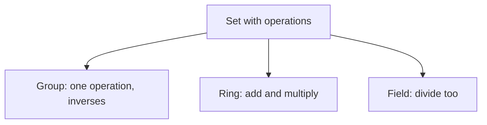

# Abstract Algebra

## Overview

Abstract algebra shifts the focus from numbers to structures. Instead of asking what x equals, it asks what rules a set and its operations obey. You start with a set, add one or more operations like a kind of addition or multiplication, and impose axioms such as associativity or the existence of an identity. Whatever satisfies those axioms belongs to the same family, whether the elements are integers, symmetries, or functions. The properties you prove hold for every member of the family at once.

This matters because it reveals deep patterns shared across seemingly unrelated objects. The symmetries of a triangle, the hours on a clock, and the nonzero fractions under multiplication all behave the same way under the right lens. The tension is between generality and concreteness. By dropping the specific meaning of the elements, you gain theorems that apply everywhere, at the cost of thinking in pure structure rather than familiar numbers.

### Quick Takeaways

- Structures are defined by axioms, not by what the elements are
- Groups, rings, and fields form a hierarchy of increasing structure
- One proof about a structure applies to every concrete example of it

## Definition

- **Algebraic structure** is a set together with operations satisfying fixed axioms.
- **Group** is a set with one associative operation, an identity, and inverses.
- **Ring** is a set with addition and multiplication that distribute properly.
- **Field** is a ring where every nonzero element has a multiplicative inverse.
- **Axiom** is a rule assumed to hold that defines the structure.
- **Homomorphism** is a map between structures that preserves their operations.

## The Analogy

Think of abstract algebra like studying board games by their rules, not their pieces. Chess and checkers use different pieces, but you can still ask which games allow a certain kind of move or guarantee a winning strategy. By focusing on the rules alone, one insight can cover many games. Abstract algebra studies mathematical objects by their rules, so one theorem covers many concrete systems.

## When You See It

- Describing symmetry in physics, chemistry, and crystallography
- Building error correcting codes and cryptographic systems
- Proving what can and cannot be solved, like the impossibility of trisecting an angle
- Organizing number systems by the operations they support
- Designing algorithms that rely on modular arithmetic

## Examples

**Good:** Recognizing that clock arithmetic, where 11 plus 2 wraps to 1, forms a group under addition modulo 12. The group axioms hold, so group theorems apply directly.

**Bad:** Assuming every set with a multiplication is a group. If elements lack inverses, like the integers under multiplication, the group axioms fail and its theorems do not apply.

## Important Points

- Structures are classified by which axioms they satisfy
- Groups capture symmetry and reversible operations
- Rings add a second operation with distribution over the first
- Fields allow division, making them the setting for most familiar algebra
- Homomorphisms and isomorphisms compare and identify structures
- Abstraction lets one theorem serve many concrete situations
- The approach proves both what is possible and what is impossible

## Summary

- Abstract algebra studies sets with operations defined by axioms.
- Groups, rings, and fields form a ladder of increasing structure.
- Dropping specific meaning yields theorems that apply broadly.
- Homomorphisms relate different structures by preserving operations.
- _Study the rules, not the pieces, and one truth covers many worlds._
