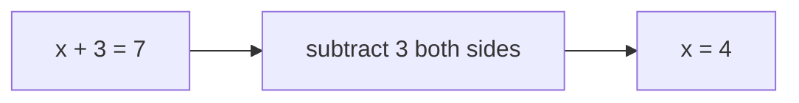
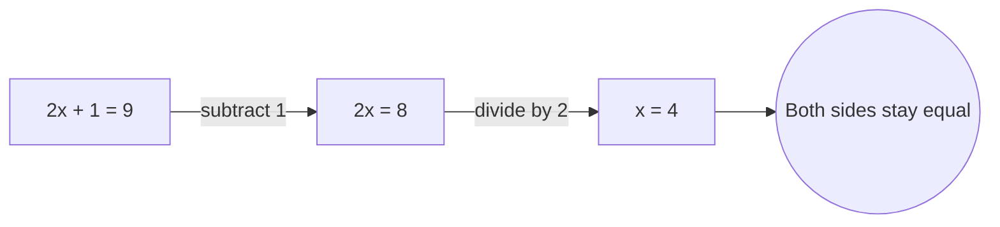
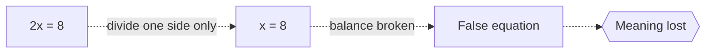

# Algebra

## Overview

Algebra is the part of mathematics where letters stand in for numbers. Instead of saying "some number plus three equals seven," you write x + 3 = 7 and work with the symbol x as if it were a real value. This lets you state a relationship once and apply it to every case that fits, rather than solving each concrete instance by hand. The symbols follow fixed rules for addition, multiplication, and equality, and those rules let you rearrange expressions without changing their meaning.

Algebra matters because it turns vague word problems into exact statements you can manipulate. The core tension is between the unknown and the known. You have an equation that ties them together, and your job is to isolate the unknown using operations that keep both sides balanced. From this simple idea grows everything from solving quadratics in school to the abstract structures that describe symmetry, cryptography, and physics.

### Quick Takeaways

- Symbols stand for unknown or general quantities, not just one fixed number
- Equations express a balance you preserve while rearranging terms
- The same rules solve infinitely many concrete cases at once

## Definition

- **Variable** is a symbol that represents an unknown or changing quantity.
- **Constant** is a fixed known value in an expression.
- **Expression** is a combination of variables, constants, and operations with no equals sign.
- **Equation** is a statement that two expressions are equal.
- **Solution** is a value of the variable that makes an equation true.
- **Operation** is a rule like addition or multiplication for combining values.

## The Analogy

Think of an equation as a balance scale. Both pans hold the same weight, so the scale stays level. If you add or remove the same amount from both pans, it stays level. Solving for x means moving weights around, always doing the same thing to both pans, until x sits alone on one side and its value shows on the other.

## When You See It

- Solving for an unknown in a word problem
- Writing a formula that works for any input, like area equals length times width
- Rearranging a physics or finance equation to isolate one quantity
- Describing patterns and sequences with a general term
- Setting up relationships in spreadsheets and code

## Examples

**Good:** Writing 2x + 1 = 9 and subtracting 1 then dividing by 2 to find x = 4. Every step keeps both sides equal, so the answer is exact.

**Bad:** Dividing only one side of an equation by 2 while leaving the other unchanged. The balance breaks and the result no longer means what you started with.

## Important Points

- Algebra generalizes arithmetic by replacing specific numbers with symbols
- Whatever operation you apply to one side of an equation you must apply to the other
- The order of operations decides how an expression is evaluated
- Like terms can be combined, unlike terms cannot
- An equation can have one solution, many, or none
- Factoring rewrites an expression as a product to reveal its roots
- Abstract algebra extends these ideas to structures beyond numbers

## Summary

- Algebra uses symbols to state and solve general numeric relationships.
- Equations describe a balance you keep while isolating the unknown.
- The same rearrangement rules cover countless specific problems.
- Solutions are the values that make an equation true.
- _Let the letter carry the unknown and the balance reveals its value._
