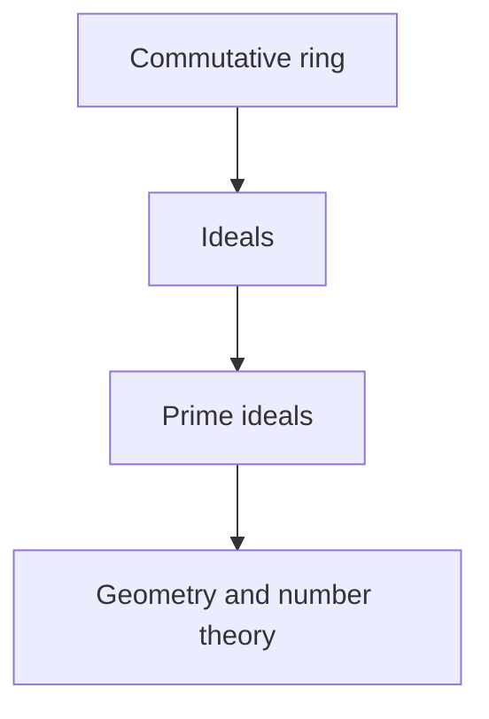

# Commutative Algebra

## Overview

Commutative algebra studies commutative rings, which are rings where the order of multiplication does not matter, so a times b equals b times a. Within these rings the central objects are ideals, special subsets that behave like generalized notions of divisibility. By studying how ideals sit inside a ring and how rings relate through maps, commutative algebra builds the machinery for understanding solutions of polynomial equations in a rigorous way.

It matters because it is the algebraic backbone of two great subjects. Algebraic geometry translates geometric shapes defined by polynomial equations into commutative rings, so every geometric question becomes a ring question. Number theory studies rings of integers where unique factorization can fail, and ideals restore order to that failure. The tension commutative algebra manages is turning geometric and arithmetic intuition into precise statements about ideals, prime ideals, and their structure.

### Quick Takeaways

- It studies commutative rings and their ideals
- Prime ideals generalize prime numbers and points of geometry
- It underlies algebraic geometry and algebraic number theory

## Definition

- **Commutative ring** is a ring where multiplication is commutative.
- **Ideal** is a subset closed under addition and absorbing multiplication by ring elements.
- **Prime ideal** is an ideal where a product lies in it only if a factor does.
- **Maximal ideal** is an ideal contained in no larger proper ideal.
- **Localization** is a process of formally inverting selected elements of a ring.
- **Noetherian ring** is a ring where every ideal is finitely generated.

## The Analogy

Think of a commutative ring as a city and its ideals as neighborhoods with strict membership rules. A prime ideal is a special kind of neighborhood that mirrors what a single geometric point or a prime number looks like from inside the ring. Studying the city means mapping how these neighborhoods nest and connect, and that map tells you the shape of the geometry or the arithmetic behind it.

## When You See It

- Building the foundations of algebraic geometry
- Studying rings of integers in algebraic number theory
- Analyzing polynomial rings and their solution sets
- Restoring unique factorization through ideals when elements fail it
- Using localization to focus on behavior near a point or prime

## Examples

**Good:** Using prime ideals of a polynomial ring to describe points and curves in algebraic geometry. Each geometric object corresponds cleanly to an ideal.

**Bad:** Applying commutative algebra tools to matrix rings, where multiplication does not commute. The theory assumes commutativity, so its results do not carry over directly.

## Important Points

- The theory requires multiplication to be commutative
- Ideals generalize divisibility and enable quotient constructions
- Prime and maximal ideals correspond to points and geometric structure
- Localization zooms in on behavior near a chosen prime or point
- Noetherian conditions keep rings manageable by bounding ideal complexity
- It provides the language algebraic geometry uses for shapes
- Ideals repair unique factorization in number rings where it fails

## Summary

- Commutative algebra studies commutative rings and their ideals.
- Prime ideals generalize primes and geometric points.
- Localization and Noetherian conditions organize ring behavior.
- It is the foundation of algebraic geometry and number theory.
- _Turn shapes and primes into ideals and geometry becomes pure algebra._
