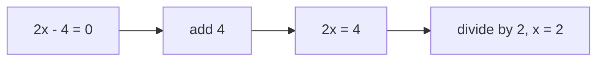
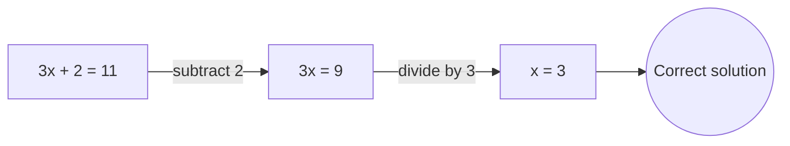
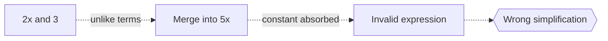

# Elementary Algebra

## Overview

Elementary algebra is the first algebra most people learn. It introduces variables as stand-ins for numbers, then teaches how to build expressions, simplify them, and solve equations. The numbers involved are usually real numbers, and the operations are the familiar ones from arithmetic extended to work with symbols. The goal is to find unknown values that make a statement true, or to rewrite a relationship in a more useful form.

It matters because it is the gateway to all later mathematics. Every science and engineering formula relies on the skills it teaches, such as isolating a variable, balancing an equation, or plotting a line. The central tension is moving from concrete arithmetic, where you compute a single answer, to symbolic reasoning, where you handle whole families of numbers at once and keep an equation balanced through every step.

### Quick Takeaways

- Variables represent numbers so one rule covers many cases
- Solving means isolating the unknown while keeping the equation balanced
- Lines and simple curves connect algebra to graphs

## Definition

- **Variable** is a letter representing an unknown or general number.
- **Coefficient** is the number multiplying a variable.
- **Linear equation** is an equation whose highest variable power is one.
- **Quadratic equation** is an equation whose highest variable power is two.
- **Inequality** is a statement comparing two expressions with less than or greater than.
- **Slope** is the rate of change of a line, its rise over run.

## The Analogy

Solving an equation is like unwrapping a gift wrapped in several layers. The variable sits inside, covered by additions and multiplications. You peel each layer off in reverse order, undoing multiplication with division and addition with subtraction, always doing the same to both sides, until the variable stands alone and its value is revealed.

## When You See It

- School and early college math courses
- Converting units or rearranging a formula to solve for one quantity
- Finding where two lines cross by solving them together
- Modeling simple growth, cost, or motion with linear or quadratic equations
- Checking whether a value satisfies an inequality or constraint

## Examples

**Good:** Solving 3x + 2 = 11 by subtracting 2 to get 3x = 9, then dividing by 3 to find x = 3. Each step keeps both sides equal.

**Bad:** Combining 2x and 3 into 5x because they sit next to each other. Only like terms combine, and a variable term cannot merge with a constant.

## Important Points

- Elementary algebra works mostly with real numbers and basic operations
- Like terms combine, but variables and constants stay separate
- The quadratic formula solves any second degree equation
- Graphs turn equations into pictures, lines for linear, parabolas for quadratic
- Inequalities flip direction when you multiply or divide by a negative
- Word problems become solvable once translated into equations

## Summary

- Elementary algebra introduces variables, expressions, and equation solving.
- It extends arithmetic into symbolic reasoning over real numbers.
- Isolating the unknown means undoing operations on both sides equally.
- Linear and quadratic equations, graphs, and inequalities are its core tools.
- _Peel back each operation in reverse and the hidden value stands revealed._
