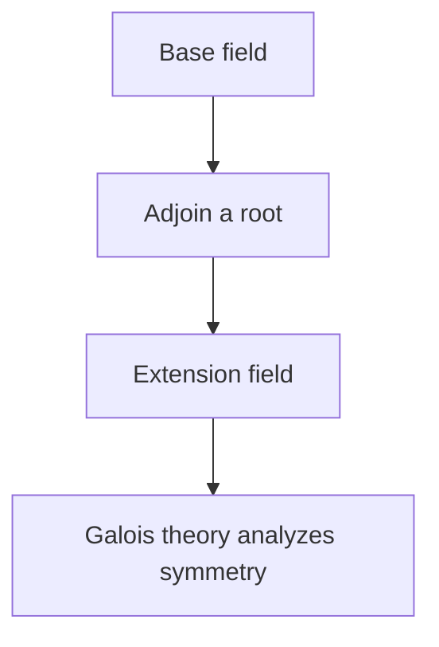

# Field Theory

## Overview

Field theory studies fields, which are the most well behaved of the basic algebraic structures. A field is a set with two operations, addition and multiplication, where both are commutative, both have identities, and every element except zero has a multiplicative inverse. In short, you can add, subtract, multiply, and divide freely, exactly as with rational or real numbers. Fields are the natural home for solving equations, because division is always available.

Fields matter because they let algebra run without obstruction. The rational numbers, real numbers, and complex numbers are all fields, and so are the finite fields used in coding and cryptography. The deep tension field theory explores is field extensions, how you grow a small field into a larger one by adding roots of polynomials. This idea led to Galois theory, which explains exactly which equations can be solved by radicals and why some cannot.

### Quick Takeaways

- A field allows addition, subtraction, multiplication, and division
- Rational, real, complex, and finite fields are the main examples
- Field extensions add roots and lead to Galois theory

## Definition

- **Field** is a commutative ring where every nonzero element has a multiplicative inverse.
- **Characteristic** is the smallest number of times you add one to reach zero, or zero if never.
- **Field extension** is a larger field containing a given smaller field.
- **Finite field** is a field with a finite number of elements.
- **Algebraic element** is one that is a root of a polynomial over the base field.
- **Galois group** is the group of symmetries of a field extension.

## The Analogy

Think of a field as a fully stocked toolbox for arithmetic. It has every tool you expect, add, subtract, multiply, and divide, with no missing pieces except the forbidden divide by zero. A field extension is like adding a new specialized tool, the root of some equation, so you can now build things the original toolbox could not. Galois theory is the manual describing how the new tools relate.

## When You See It

- Solving polynomial equations where division is needed
- Using finite fields in error correcting codes and cryptography
- Analyzing which classical constructions are possible with compass and straightedge
- Proving certain equations cannot be solved by radicals
- Defining vector spaces, which are built over a field of scalars

## Examples

**Good:** Treating the rational numbers with ordinary operations as a field. Every nonzero rational has an inverse, so division is always defined.

**Bad:** Calling the integers a field. The number 3 has no integer inverse, so division fails and the field axioms are not satisfied.

## Important Points

- Fields support all four arithmetic operations, division included except by zero
- The characteristic is either zero or a prime number
- Finite fields exist only with a prime power number of elements
- Field extensions add roots of polynomials to a base field
- Galois theory links field extensions to group symmetry
- Vector spaces and linear algebra are defined over an underlying field
- Solvability of an equation by radicals depends on its Galois group

## Summary

- A field allows addition, subtraction, multiplication, and division.
- Rational, real, complex, and finite fields are the core examples.
- Field extensions grow a field by adjoining polynomial roots.
- Galois theory connects those extensions to group symmetry.
- _Give arithmetic every operation without gaps and equations find their true home._
