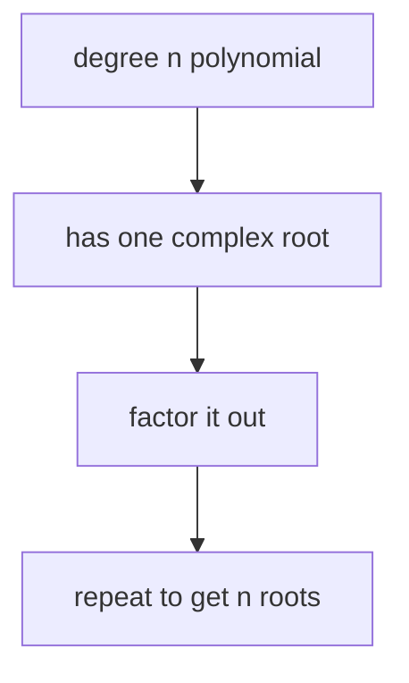
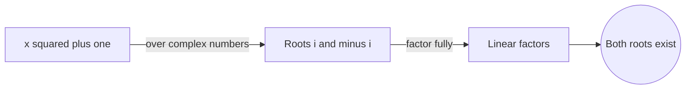
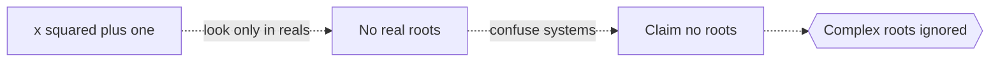

# Fundamental Theorem of Algebra

## Overview

The fundamental theorem of algebra says that every polynomial of degree one or higher, with complex coefficients, has at least one complex root. Once you have one root you can factor it out and repeat, so a polynomial of degree n has exactly n roots when you count multiplicity. This means the complex numbers are algebraically closed. You never need to invent a bigger number system to solve a polynomial equation, no matter how high its degree.

This matters because it settles a long historical worry. Real numbers alone cannot solve x squared plus one equals zero, so people feared each new equation might demand a new kind of number forever. The theorem ends that fear. The tension it resolves is completeness. Adding the single imaginary unit i is enough to guarantee that all polynomial equations have solutions inside the complex plane.

### Quick Takeaways

- Every non-constant complex polynomial has at least one complex root
- A degree n polynomial has exactly n roots counting multiplicity
- The complex numbers are algebraically closed, no larger system needed

## Definition

- **Polynomial** is a sum of terms, each a coefficient times a power of the variable.
- **Degree** is the highest power of the variable in the polynomial.
- **Root** is a value that makes the polynomial equal to zero.
- **Multiplicity** is how many times a given root repeats as a factor.
- **Complex number** is a value of the form a + bi where i squared equals minus one.
- **Algebraically closed** means every non-constant polynomial has a root in the system.

## The Analogy

Imagine a lock that only opens with the right key. For a while it seemed each new equation was a lock needing its own strange new key. The theorem shows one master key, the imaginary unit i, opens every polynomial lock. You never have to forge a new key. The complex plane already holds a key for every equation you can write.

## When You See It

- Factoring polynomials completely into linear factors over the complex numbers
- Counting the expected number of solutions to a polynomial equation
- Analyzing eigenvalues of matrices, which are roots of a characteristic polynomial
- Signal processing where filter poles and zeros are polynomial roots
- Justifying why complex numbers are the natural home for algebra

## Examples

**Good:** Stating that x squared plus one equals zero has the two roots i and minus i. Over the complex numbers the polynomial factors fully and both roots exist.

**Bad:** Claiming x squared plus one has no roots because none are real. The theorem only guarantees roots in the complex numbers, not the reals, so the claim confuses the two systems.

## Important Points

- The theorem guarantees existence of a root but not a formula to compute it
- Counting multiplicity, a degree n polynomial always has exactly n complex roots
- Real polynomials can have complex roots, which come in conjugate pairs
- The result fails over the real numbers, which are not algebraically closed
- Common proofs use complex analysis, topology, or Galois theory, not elementary algebra
- It underpins the factorization of polynomials into linear factors

## Summary

- Every non-constant complex polynomial has at least one complex root.
- Repeated factoring gives exactly n roots for a degree n polynomial.
- The complex numbers are algebraically closed and need no extension.
- It guarantees existence, not an explicit method to find roots.
- _One imaginary unit closes the door, and every polynomial finds its solutions._
