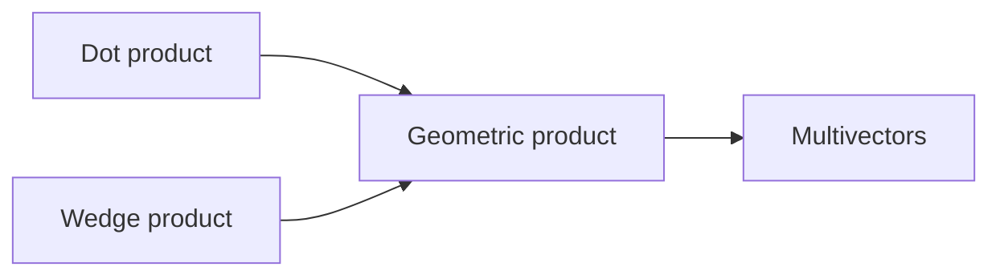
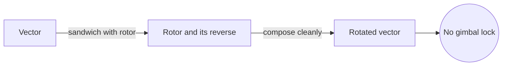
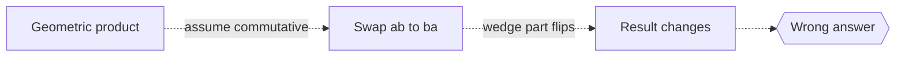

# Geometric Algebra

## Overview

Geometric algebra is a system that extends ordinary vector algebra by adding a single new multiplication called the geometric product. This product combines two familiar ideas, the dot product and a directed area called the wedge product, into one operation. The result lets you multiply vectors together and get objects that represent not just lengths and angles but also oriented planes and volumes. These higher objects, called multivectors, carry geometric meaning directly in the algebra.

It matters because it unifies many separate tools of geometry and physics into one framework. Complex numbers, quaternions, and cross products all become special cases of the geometric product. The tension it resolves is fragmentation. Traditional physics uses different notations for rotations, reflections, and oriented areas, but geometric algebra expresses them all with one product and one kind of object, making rotations and reflections especially clean to compute.

### Quick Takeaways

- The geometric product merges the dot and wedge products
- Multivectors represent points, lines, planes, and volumes uniformly
- It unifies complex numbers, quaternions, and cross products

## Definition

- **Geometric product** is the combined operation ab equal to the dot part plus the wedge part.
- **Wedge product** is an operation producing an oriented area or higher volume.
- **Multivector** is a sum of scalars, vectors, and higher graded elements.
- **Bivector** is an oriented plane element, the wedge of two vectors.
- **Grade** is the dimension of the geometric object, zero for scalars, one for vectors.
- **Rotor** is a multivector that performs a rotation through the geometric product.

## The Analogy

Think of geometric algebra as a Swiss Army knife for geometry. Older methods carry separate tools, one for angles, one for areas, one for rotations. Geometric algebra folds them into a single tool where one move, the geometric product, does the job of many. You stop switching between notations and instead turn one handle to reach dots, wedges, and rotations alike.

## When You See It

- Computing rotations in graphics and robotics without messy trigonometry
- Reformulating electromagnetism and mechanics in a unified language
- Replacing quaternions with rotors for cleaner rotation composition
- Describing oriented areas and volumes directly as algebraic objects
- Teaching geometry where reflections and rotations combine naturally

## Examples

**Good:** Using a rotor to rotate a vector by sandwiching it between the rotor and its reverse. The operation composes rotations cleanly and avoids gimbal lock issues.

**Bad:** Treating the geometric product as ordinary commutative multiplication. For vectors it is generally not commutative, so swapping order changes the wedge part and the result.

## Important Points

- The geometric product is associative but not generally commutative
- The symmetric part is the dot product, the antisymmetric part is the wedge
- Bivectors encode oriented planes, generalizing the cross product to any dimension
- Rotors perform rotations more robustly than Euler angles
- Complex numbers and quaternions embed as special subalgebras
- It is a concrete instance of the broader Clifford algebras
- One framework replaces several separate geometric formalisms

## Summary

- Geometric algebra adds a geometric product to vector algebra.
- That product fuses the dot and wedge into one operation.
- Multivectors represent objects of every dimension uniformly.
- Rotations, reflections, complex numbers, and quaternions all fit inside.
- _Fold every geometric tool into one product and geometry speaks a single language._
