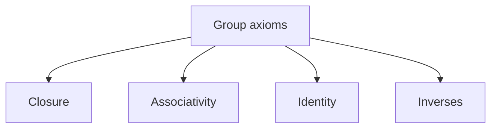
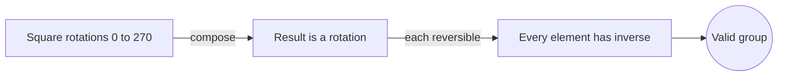

# Group Theory

## Overview

Group theory studies groups, which are among the simplest and most powerful structures in algebra. A group is a set together with a single operation that combines any two elements into a third. That operation must be associative, there must be an identity element that changes nothing, and every element must have an inverse that undoes it. These four requirements are enough to capture the essence of symmetry and reversible action across all of mathematics.

Groups matter because symmetry is everywhere. The rotations of a square, the shuffles of a deck, the moves of a Rubik's cube, and the conservation laws of physics all form groups. The tension group theory resolves is how to talk about very different symmetric systems with one language. By reducing each system to its operation and axioms, you can prove results once and apply them to rotations, permutations, and particle physics alike.

### Quick Takeaways

- A group needs closure, associativity, an identity, and inverses
- Groups formalize symmetry and reversible operations
- One set of theorems covers rotations, permutations, and more

## Definition

- **Group** is a set with an operation satisfying closure, associativity, identity, and inverses.
- **Identity element** is the element that leaves others unchanged under the operation.
- **Inverse** is the element that combines with a given one to give the identity.
- **Abelian group** is a group whose operation is commutative.
- **Subgroup** is a subset that is itself a group under the same operation.
- **Order** is the number of elements in a group, or the smallest power giving the identity.

## The Analogy

Think of a group as the set of all moves you can make on a Rubik's cube. Doing nothing is the identity. Every twist can be undone by twisting back, so every move has an inverse. Combining two twists gives another valid move, so the set is closed. The moves capture the cube's symmetry exactly, and studying them is studying the cube's group.

## When You See It

- Describing symmetries of shapes, molecules, and crystals
- Analyzing permutations and shuffles in combinatorics
- Building cryptographic systems on modular arithmetic groups
- Classifying particles and forces in theoretical physics
- Proving which equations are solvable by radicals through Galois theory

## Examples

**Good:** Treating the rotations of a square by 0, 90, 180, and 270 degrees as a group under composition. Every rotation has an inverse and composing two gives another rotation.

**Bad:** Calling the set of positive integers under subtraction a group. Subtraction is not associative in the needed sense and inverses fall outside the set, so the axioms fail.

## Important Points

- The four group axioms are closure, associativity, identity, and inverses
- Abelian groups add commutativity, where order of operation does not matter
- Every group has subgroups, and Lagrange's theorem relates their orders
- Permutation groups underlie the symmetry of any finite structure
- Group homomorphisms preserve the operation between groups
- Simple groups are the building blocks, classified in a monumental effort
- Symmetry in physics is described through continuous Lie groups

## Summary

- A group is a set with one operation obeying four simple axioms.
- Groups formalize symmetry and reversible action.
- Subgroups, order, and homomorphisms are core tools for analysis.
- The same theory serves geometry, cryptography, and physics.
- _Capture every reversible move in one operation and symmetry becomes algebra._
