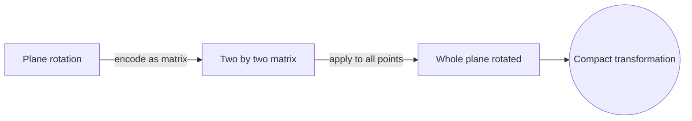

# Linear Algebra

## Overview

Linear algebra is the study of vectors, vector spaces, and the linear maps between them. A vector is an object you can add to another vector and scale by a number, and a vector space is the collection of all such objects that follow consistent rules. A linear map is a transformation that preserves addition and scaling, so straight lines stay straight and the origin stays fixed. Matrices are the concrete tool for representing these maps and computing with them.

It matters because linearity is the simplest and most useful kind of relationship, and an enormous range of problems are either linear or well approximated by something linear. Solving systems of equations, rotating and projecting in graphics, compressing data, and training machine learning models all rest on linear algebra. The tension it manages is capturing rich transformations with the disciplined structure of linear maps, which keeps computation tractable while still expressing a great deal.

### Quick Takeaways

- Vectors add and scale, and vector spaces collect them under fixed rules
- Linear maps preserve addition and scaling and are represented by matrices
- Systems of equations, transformations, and data live in this framework

## Definition

- **Vector** is an object that can be added to another and scaled by a number.
- **Vector space** is a set of vectors closed under addition and scaling.
- **Linear map** is a function preserving vector addition and scalar multiplication.
- **Matrix** is a rectangular array of numbers representing a linear map.
- **Basis** is a minimal set of vectors that spans the whole space.
- **Eigenvector** is a vector whose direction is unchanged by a linear map, only scaled.

## The Analogy

Think of a vector space as a room and vectors as arrows from one fixed corner. A linear map is a consistent stretching, rotating, or shearing of the whole room, done so that grid lines stay straight and evenly spaced. A matrix is the instruction sheet for that transformation. Applying the matrix to an arrow tells you exactly where the transformation sends it.

## When You See It

- Solving systems of linear equations
- Rotating, scaling, and projecting objects in computer graphics
- Reducing dimensions and compressing data with techniques like PCA
- Representing and training layers of neural networks
- Analyzing stability and vibration through eigenvalues

## Examples

**Good:** Representing a rotation of the plane as a two by two matrix and applying it to every point at once. The matrix captures the entire transformation compactly.

**Bad:** Modeling a curved, nonlinear relationship with a single linear map and expecting it to fit. Linear maps keep lines straight, so genuine curvature cannot be captured without extension.

## Important Points

- Linearity means the map preserves addition and scalar multiplication
- A basis lets you describe any vector by a unique list of coordinates
- Matrix multiplication composes linear maps
- The rank of a matrix measures how much the map compresses space
- Eigenvalues and eigenvectors reveal a map's natural axes and scaling
- Determinants tell you how volume and orientation change under a map
- Many nonlinear problems are solved by local linear approximation

## Summary

- Linear algebra studies vectors, vector spaces, and linear maps.
- Matrices represent those maps and make computation concrete.
- Bases, rank, eigenvalues, and determinants describe a map's behavior.
- It powers graphics, data science, and scientific computing.
- _Keep the grid lines straight and evenly spaced, and transformations become matrices._
