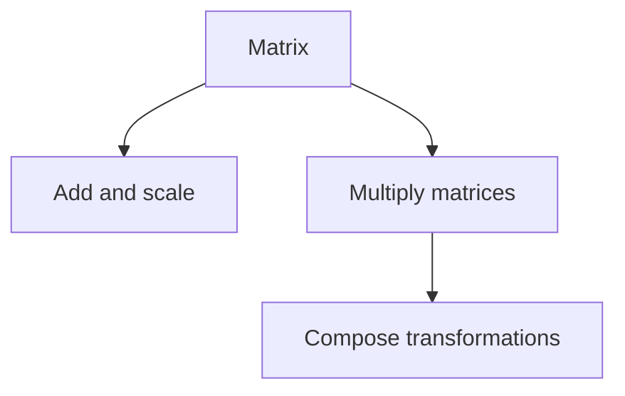

# Matrix Theory

## Overview

Matrix theory studies matrices, which are rectangular arrays of numbers arranged in rows and columns. A matrix packages a set of coefficients or a linear transformation into a single grid that you can manipulate with defined operations. You can add matrices of the same shape, multiply a matrix by a number, and multiply two compatible matrices together. Matrix multiplication is the key operation because it composes transformations and encodes how one grid acts on another.

It matters because matrices are the workhorse of computation across science and engineering. They store systems of equations, represent rotations and projections, hold the weights of neural networks, and describe transitions in probability. The tension matrix theory handles is that matrix multiplication does not commute, so order matters, and many familiar arithmetic habits break. Understanding properties like rank, determinant, inverse, and eigenvalues tells you what a matrix does and whether it can be undone.

### Quick Takeaways

- A matrix is a grid of numbers representing coefficients or a transformation
- Matrix multiplication composes transformations but does not commute
- Rank, determinant, and eigenvalues reveal a matrix's behavior

## Definition

- **Matrix** is a rectangular array of numbers with rows and columns.
- **Matrix multiplication** is the operation combining rows of one with columns of another.
- **Identity matrix** is the square matrix that leaves others unchanged when multiplied.
- **Inverse** is the matrix that multiplies with a given one to give the identity.
- **Determinant** is a number measuring how a square matrix scales volume.
- **Rank** is the number of independent rows or columns in a matrix.

## The Analogy

Think of a matrix as a machine with input dials and output gauges. Feed a list of numbers in, and the machine mixes them according to its grid to produce a new list. Stacking two machines in sequence is matrix multiplication, and the order you stack them changes the result. The determinant tells you whether the machine can be run in reverse to recover the original input.

## When You See It

- Solving large systems of linear equations
- Transforming coordinates in graphics, robotics, and physics
- Storing and multiplying weights in machine learning models
- Modeling state transitions with Markov and transition matrices
- Analyzing networks through adjacency and Laplacian matrices

## Examples

**Good:** Multiplying a transformation matrix by a coordinate vector to move every point of an object at once. The single product applies the transformation uniformly.

**Bad:** Assuming AB equals BA for matrices. Matrix multiplication is generally noncommutative, so swapping the order usually changes or invalidates the result.

## Important Points

- Matrix multiplication is associative but not commutative
- A matrix has an inverse only when its determinant is nonzero
- Rank measures how much information a matrix preserves versus collapses
- Eigenvalues and eigenvectors expose a matrix's natural scaling directions
- Special forms like diagonal and triangular matrices simplify computation
- Decompositions like LU and QR make solving and factoring efficient
- The shape must be compatible for two matrices to multiply

## Summary

- A matrix is a grid of numbers encoding coefficients or a transformation.
- Multiplication composes transformations but order matters.
- Determinant, rank, inverse, and eigenvalues describe its action.
- Matrices power equation solving, graphics, and machine learning.
- _Pack the numbers into a grid and one machine transforms them all at once._
