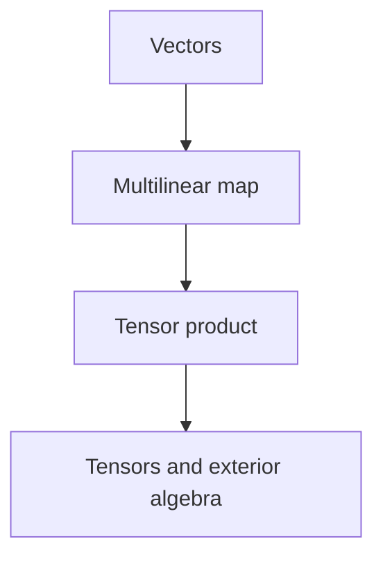
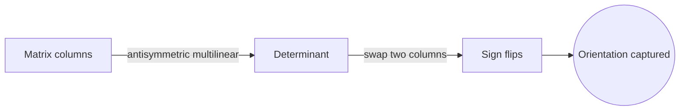
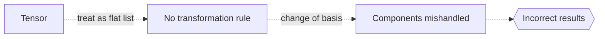

# Multilinear Algebra

## Overview

Multilinear algebra extends linear algebra from maps of one vector to maps of several vectors at once. A multilinear map is linear in each of its arguments separately, meaning if you hold all but one input fixed, it behaves like an ordinary linear map in the remaining one. This idea captures objects that depend on several directions simultaneously, such as areas, volumes, and more general tensors that store multidimensional relationships.

It matters because many quantities in geometry and physics are naturally multilinear rather than linear. The determinant is a multilinear function of a matrix's columns. Stress, strain, and curvature in physics are tensors, which are the central objects of multilinear algebra. The tension it handles is complexity growth. Adding more arguments multiplies the amount of data, so multilinear algebra develops tools like the tensor product and exterior algebra to organize that data cleanly.

### Quick Takeaways

- A multilinear map is linear in each argument separately
- Tensors generalize vectors and matrices to many indices
- Determinants and exterior products are multilinear tools

## Definition

- **Multilinear map** is a function linear in each of its several arguments.
- **Tensor** is an object with several indices that transforms multilinearly.
- **Tensor product** is the construction that combines vector spaces into a larger one.
- **Exterior product** is an antisymmetric multilinear product giving oriented volumes.
- **Rank of a tensor** is the number of indices it carries.
- **Determinant** is the antisymmetric multilinear function of a matrix's columns.

## The Analogy

Think of a linear map as a machine with one input slot. A multilinear map is a machine with several input slots, and it responds proportionally when you adjust any single slot while holding the others still. A tensor is the full blueprint of such a multi slot machine. It records how the output depends on every combination of the inputs at once.

## When You See It

- Working with tensors in physics, such as stress and curvature
- Computing determinants and volumes through antisymmetric products
- Handling multidimensional data arrays in machine learning
- Formulating general relativity and continuum mechanics
- Building the exterior algebra used in differential forms

## Examples

**Good:** Viewing the determinant as an antisymmetric multilinear function of a matrix's columns. Swapping two columns flips the sign, which reflects orientation cleanly.

**Bad:** Treating a tensor as if it were an ordinary flat list of numbers with no transformation rule. Tensors change in a specific multilinear way under a change of basis, so ignoring that gives wrong results.

## Important Points

- Multilinearity means linearity holds in each argument independently
- The tensor product builds spaces whose elements are tensors
- Symmetric and antisymmetric parts split multilinear maps usefully
- The exterior product encodes oriented area and volume
- Determinants are the prime example of an antisymmetric multilinear map
- Tensors obey specific transformation rules under basis change
- Data complexity grows quickly, so organizing tools are essential

## Summary

- Multilinear algebra extends linearity to several arguments at once.
- Tensors generalize vectors and matrices to many indices.
- The tensor and exterior products organize multilinear objects.
- Determinants and physical tensors are its central examples.
- _Add more input slots and keep each linear, and vectors grow into tensors._
