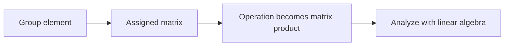
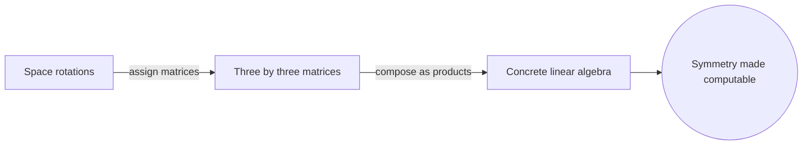

# Representation Theory

## Overview

Representation theory studies abstract structures like groups and algebras by turning their elements into concrete linear maps on a vector space. Instead of reasoning about an abstract group operation directly, you assign each group element a matrix so that combining elements matches multiplying matrices. This turns hard abstract questions into linear algebra, where powerful and familiar tools are available. The map that does this is called a representation.

It matters because it bridges two worlds. Abstract algebra offers structure but few computational tools, while linear algebra offers many. Representation theory carries the abstract structure into a setting where you can compute eigenvalues, decompose spaces, and classify behavior. The tension it resolves is accessibility. Symmetry groups in physics and chemistry become tractable once represented as matrices, which is why the theory is central to quantum mechanics and particle physics.

### Quick Takeaways

- A representation maps group elements to matrices preserving the operation
- Abstract structure becomes concrete linear algebra
- It is central to symmetry in physics and chemistry

## Definition

- **Representation** is a map from a structure to linear maps preserving the operation.
- **Group representation** assigns a matrix to each group element consistently.
- **Irreducible representation** is one with no proper invariant subspace.
- **Character** is the trace of the representing matrix, a fingerprint of the representation.
- **Invariant subspace** is a subspace mapped into itself by every representing matrix.
- **Dimension** is the size of the vector space the representation acts on.

## The Analogy

Think of an abstract group as a set of dance moves described only by words. Hard to analyze in the abstract. A representation is like filming each move as a concrete motion of a body in space. Now you can measure angles, combine motions, and compare them precisely. The words become visible actions, and studying the film is far easier than studying the words alone.

## When You See It

- Analyzing symmetry in quantum mechanics and particle physics
- Classifying molecular vibrations and spectra in chemistry
- Decomposing signals with harmonic analysis and Fourier methods
- Studying groups through their matrix actions
- Building models where symmetry constrains the possible states

## Examples

**Good:** Representing rotations of space as three by three matrices, so composing rotations becomes multiplying matrices. Symmetry questions turn into concrete linear algebra.

**Bad:** Assuming every representation reveals the full structure of the group. A trivial representation sending all elements to the identity matrix loses almost all information about the group.

## Important Points

- A representation preserves the operation as matrix multiplication
- Irreducible representations are the indivisible building blocks
- Characters classify representations and simplify computations
- Decomposing a representation into irreducibles reveals hidden structure
- The same group can have many representations of different dimensions
- Physics uses representations to encode symmetry and conservation laws
- The theory connects abstract algebra tightly to linear algebra

## Summary

- Representation theory turns abstract elements into matrices on a vector space.
- It converts hard abstract questions into tractable linear algebra.
- Irreducible representations and characters organize the theory.
- It is essential to symmetry analysis in physics and chemistry.
- _Film the abstract moves as concrete motions and structure becomes computable._
