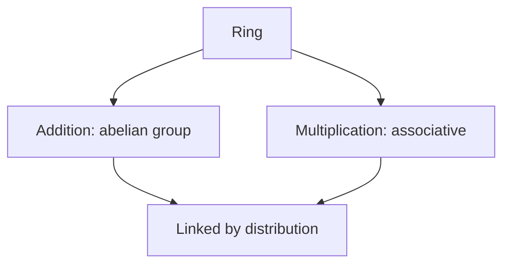

# Ring Theory

## Overview

Ring theory studies rings, which extend groups by giving a set two operations instead of one. The first behaves like addition and forms an abelian group. The second behaves like multiplication and is associative. The two are tied together by the distributive law, which says multiplication spreads across addition. This is exactly how the integers work, and rings generalize that familiar arithmetic to many other systems such as polynomials and matrices.

Rings matter because so much of mathematics has both an additive and a multiplicative side. Polynomials can be added and multiplied. So can matrices, functions, and remainders under modular arithmetic. The tension ring theory handles is that multiplication in a ring need not be as nice as in ordinary numbers. It may not commute, and elements may lack inverses, so the theory carefully tracks which good properties survive and which do not.

### Quick Takeaways

- A ring has two operations, additive group plus associative multiplication
- The distributive law links addition and multiplication
- Multiplication may not commute or have inverses in a general ring

## Definition

- **Ring** is a set with addition forming an abelian group and associative multiplication.
- **Distributive law** is the rule that a times (b plus c) equals ab plus ac.
- **Commutative ring** is a ring where multiplication order does not matter.
- **Unit** is an element with a multiplicative inverse in the ring.
- **Ideal** is a special subset closed under addition and absorbing multiplication.
- **Zero divisor** is a nonzero element whose product with another nonzero element is zero.

## The Analogy

Think of a ring as a workshop with two machines. One machine, addition, always runs smoothly and can be reversed to undo any step. The other machine, multiplication, is powerful but pickier. It runs in a fixed order sometimes, and not every part has a matching part to reverse it. The distributive law is the belt connecting the two machines so they work together.

## When You See It

- Working with polynomials, which form a ring under the usual operations
- Doing modular arithmetic, where remainders form a ring
- Manipulating matrices, which multiply but do not always commute
- Studying number theory through rings of integers
- Building coding and cryptographic schemes on finite rings

## Examples

**Good:** Treating the integers with ordinary addition and multiplication as a commutative ring. Both operations behave, and distribution holds throughout.

**Bad:** Assuming every ring lets you divide. In the integers, 2 has no multiplicative inverse, so division is not generally available and treating it as a field is wrong.

## Important Points

- A ring combines an additive group with an associative multiplication
- Distribution is what ties the two operations into one structure
- Commutative rings are the setting for much of number theory
- Ideals generalize the notion of divisibility and enable quotient rings
- Zero divisors show multiplication can behave unlike ordinary numbers
- Fields are the special rings where every nonzero element is a unit
- Polynomial and matrix rings are central working examples

## Summary

- A ring has addition forming a group and an associative multiplication.
- The distributive law binds the two operations together.
- Multiplication may lack commutativity or inverses in general.
- Ideals, units, and zero divisors describe a ring's internal behavior.
- _Two operations, one distributive belt, and ordinary arithmetic grows into a whole theory._
