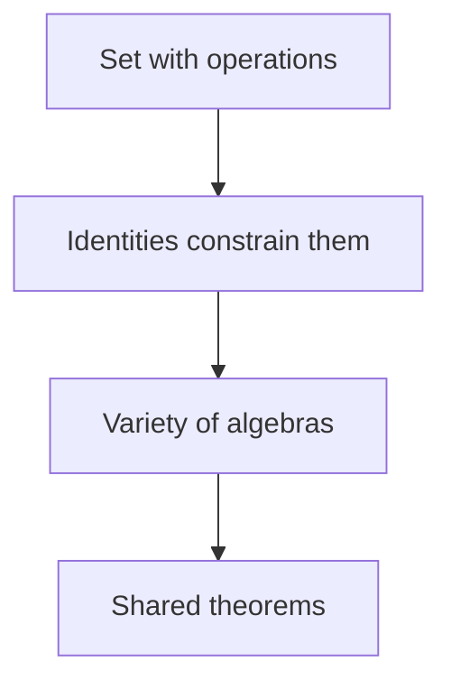

# Universal Algebra

## Overview

Universal algebra studies algebraic structures at the most general level. Rather than examining groups, rings, or lattices one by one, it treats them all as sets equipped with operations that satisfy certain identities. An operation takes a fixed number of inputs and returns an output, and an identity is an equation that must hold for all elements. By focusing on operations and identities alone, universal algebra finds theorems that apply to every structure of a given kind at once.

It matters because it unifies patterns that repeat across algebra. Concepts like subalgebra, homomorphism, and quotient appear in groups, rings, and lattices in the same form, and universal algebra proves them once for all. The tension it addresses is the trade off between generality and detail. By stripping away the specific meaning of each operation, it gains sweeping results, but it must work at a level of abstraction where the objects are just sets with labeled operations.

### Quick Takeaways

- Structures are sets with operations obeying identities
- Subalgebras, homomorphisms, and quotients generalize across all of them
- One framework covers groups, rings, lattices, and more

## Definition

- **Operation** is a function taking a fixed number of arguments from a set to that set.
- **Signature** is the list of operations and their arities for a structure.
- **Identity** is an equation required to hold for all elements.
- **Variety** is a class of algebras defined by a set of identities.
- **Subalgebra** is a subset closed under all the operations.
- **Congruence** is an equivalence relation compatible with the operations, giving quotients.

## The Analogy

Think of universal algebra as studying recipes rather than dishes. A group, a ring, and a lattice are different dishes, but each follows a recipe listing ingredients, which are the operations, and rules, which are the identities. By comparing recipes rather than tasting each dish, you notice shared techniques. Universal algebra reads the recipes and proves what any dish following similar rules must satisfy.

## When You See It

- Unifying constructions like quotients and products across algebra
- Defining classes of structures by the identities they obey
- Studying lattices, semigroups, and other less familiar structures
- Providing foundations for parts of theoretical computer science
- Comparing structures through their signatures and identities

## Examples

**Good:** Defining the variety of groups by the identities for associativity, identity, and inverses, then proving a homomorphism theorem that holds for all of them at once.

**Bad:** Expecting universal algebra to give detailed results about a specific group's subgroup lattice. Its strength is generality, so fine structural detail of one object lies outside its focus.

## Important Points

- Structures are captured by a signature of operations and a set of identities
- A variety is all algebras satisfying a chosen set of identities
- Subalgebras, products, and quotients are defined uniformly
- Congruences replace normal subgroups and ideals as the source of quotients
- Birkhoff's theorem characterizes varieties by closure properties
- The framework covers exotic structures beyond groups and rings
- It connects algebra to logic and theoretical computer science

## Summary

- Universal algebra studies sets with operations obeying identities.
- Varieties group together all algebras sharing the same identities.
- Subalgebra, homomorphism, and quotient generalize across structures.
- It trades specific detail for theorems of wide reach.
- _Compare the recipes, not the dishes, and one rule governs many structures._
