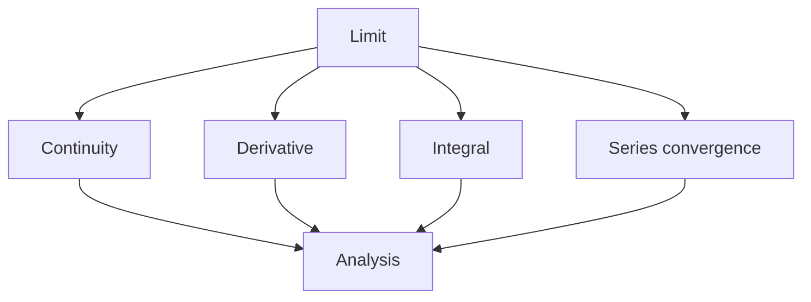
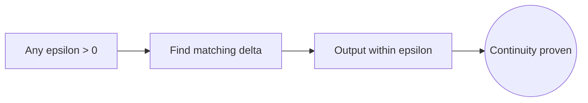
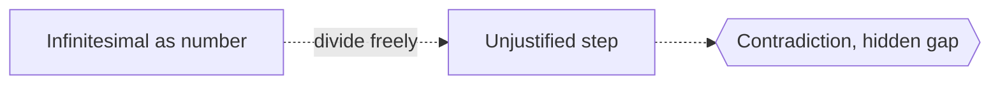

# Analysis

## Overview

Analysis is the part of mathematics built on the idea of a limit. It studies how quantities behave as they get arbitrarily close to something, how functions change, and how infinite sums and processes settle down to finite answers. Where algebra manipulates finite expressions, analysis handles the infinite in a careful, controlled way. It gives precise meaning to words like continuous, smooth, and convergent that everyday speech leaves vague.

Analysis matters because so much of science is written in the language of change. Calculus, differential equations, probability, and physics all rest on it. The key tension is rigor versus intuition. Early practitioners used infinitesimals loosely and got right answers, but the foundations were shaky. Modern analysis replaced hand waving with the epsilon-delta definition of a limit, so every claim about the infinite can be checked step by step.

### Quick Takeaways

- Analysis is the rigorous study of limits, continuity, and infinite processes
- It gives exact meaning to change, closeness, and convergence
- The epsilon-delta limit replaced loose infinitesimals with checkable definitions

## Definition

- **Limit** is the value a function or sequence approaches as its input approaches some point.
- **Continuity** means small changes in input cause only small changes in output, with no jumps.
- **Convergence** means a sequence or series settles toward a single finite value.
- **Epsilon-delta** is the formal rule that makes "arbitrarily close" precise and testable.
- **Completeness** is the property of the real numbers that no gaps break a bounded process.
- **Metric** is a distance function that lets analysis extend beyond the real line.

## The Analogy

Think of walking toward a wall by always halving the remaining distance. You never step onto the wall, yet you clearly head toward one exact spot. Analysis is the toolkit that lets you say precisely where you are heading and how close you get after each step, without needing to actually arrive. It turns "getting closer and closer" into a statement you can prove.

## When You See It

- Defining derivatives and integrals in calculus
- Proving that an infinite series adds up to a finite number
- Studying whether numerical methods converge to the true answer
- Building probability theory on measures and integration
- Modeling physical systems with differential equations
- Checking that an approximation gets better as you refine it

## Examples

**Good:** Using the epsilon-delta definition to prove that a specific function is continuous at a point. The argument works for any tolerance you demand, so the claim is airtight.

**Bad:** Treating an infinitesimal as a plain number you can freely divide by without justification. That loose reasoning can produce contradictions and hides where a proof actually breaks.

## Important Points

- Analysis rests on the completeness of the real numbers, which fills every gap
- The epsilon-delta definition turns vague closeness into a precise, checkable claim
- Continuity, differentiability, and integrability are distinct and increasingly strong conditions
- Convergence can be pointwise or uniform, and the difference changes what you may conclude
- Real analysis, complex analysis, and functional analysis are major branches with shared roots
- Counterexamples matter as much as theorems, since they mark the exact limits of a rule
- Rigor guards against paradoxes that naive use of the infinite can produce

## Summary

- Analysis is the rigorous study of limits, continuity, and infinite processes.
- It gives exact meaning to change, closeness, and convergence.
- The epsilon-delta limit replaced loose infinitesimals with provable statements.
- It underpins calculus, differential equations, and much of modern science.
- Its branches share one foundation, the careful handling of the infinite.
- _Analysis is how mathematics tames the infinite without ever quite reaching it._
