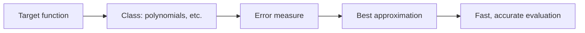
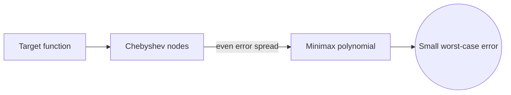
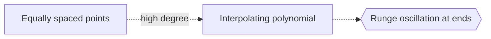

# Approximation Theory

## Overview

Approximation theory studies how to replace a complicated function with a simpler one that is close enough, and how to measure and minimize the error. The simpler functions are usually polynomials, trigonometric sums, or rational functions, because they are easy to compute and manipulate. The theory asks two questions. How small can the error be made with a given class of approximants, and which specific approximation achieves that best error.

It matters because computers and formulas cannot handle most functions exactly. Every time a calculator evaluates a sine or a library computes a logarithm, it uses an approximation designed by this theory. The central idea is choosing the right error measure. Minimizing the worst-case error gives the minimax approximation, while minimizing average squared error gives least squares. Chebyshev's insight, spreading the error evenly, produces approximations that are far better than naive ones.

### Quick Takeaways

- It measures how closely simple functions can approximate complex ones
- The choice of error measure defines what best means
- Spreading error evenly, as Chebyshev showed, beats naive fitting

## Definition

- **Approximation** replaces a function with a simpler one that is close.
- **Approximant** is the simple function used, often a polynomial.
- **Error measure** quantifies the gap, such as maximum or squared error.
- **Minimax approximation** minimizes the largest error over the interval.
- **Least squares** minimizes the total squared error.
- **Chebyshev polynomials** are a basis that spreads approximation error evenly.

## The Analogy

Think of tracing a winding coastline with a few straight line segments. You want the tracing close everywhere, not just in a few spots. If you cluster your segments in one area, another area drifts far off. The best tracing spreads the gaps evenly so the worst deviation is as small as possible. Approximation theory is the precise version of choosing where to place those segments to keep the largest error tiny.

## When You See It

- Computing sine, exponential, and log in numerical libraries
- Fitting smooth curves to noisy data
- Compressing signals and images with basis functions
- Designing digital filters in signal processing
- Building fast surrogate models for expensive simulations
- Interpolating tables of measured values

## Examples

**Good:** Using a Chebyshev-based polynomial to approximate a function so the maximum error is minimized across the interval. The even error spread avoids the large end-point errors of naive fits.

**Bad:** Interpolating a function at many equally spaced points with a high-degree polynomial. This can oscillate wildly near the ends, the Runge phenomenon, making the approximation worse, not better.

## Important Points

- The best approximation depends entirely on the chosen error measure
- Minimax minimizes worst-case error, least squares minimizes average squared error
- Chebyshev polynomials spread error evenly and avoid end-point blowup
- Equally spaced high-degree interpolation can oscillate badly, the Runge phenomenon
- Weierstrass proved any continuous function can be approximated by polynomials as closely as desired
- Rational and spline approximations often beat polynomials for tricky functions
- Convergence rate depends on the smoothness of the target function

## Summary

- Approximation theory replaces complex functions with simple close ones.
- The chosen error measure defines what the best approximation means.
- Minimax and least squares target worst-case and average error.
- Chebyshev's even error spread greatly outperforms naive fitting.
- It powers the function evaluations inside every numerical library.
- _Approximation theory places simple pieces so the worst error stays as small as possible._
