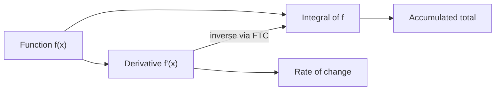
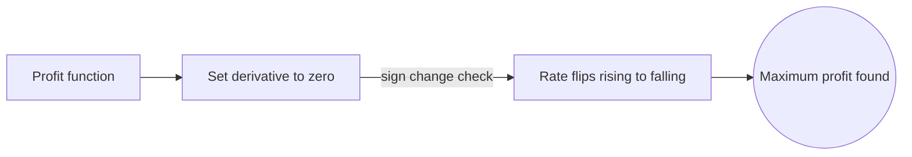

# Calculus

## Overview

Calculus is the mathematics of continuous change. It has two core operations. The derivative measures how fast something changes at an instant, like the speed of a car at one moment. The integral adds up many tiny pieces to find a total, like the distance covered over a trip. Both are defined using limits, which is why calculus sits inside analysis. Together they turn smooth curves and motion into quantities you can compute.

Calculus matters because most of the physical world varies continuously rather than in discrete jumps. Position, temperature, current, and population all change smoothly, and calculus is the tool that describes and predicts that change. The central insight is that differentiation and integration are inverse operations. This link, the fundamental theorem, lets you solve accumulation problems by reversing rate problems, and vice versa.

### Quick Takeaways

- The derivative measures an instantaneous rate of change
- The integral accumulates many small pieces into a total
- Differentiation and integration are inverse operations

## Definition

- **Derivative** is the limit of the average rate of change as the interval shrinks to zero.
- **Integral** is the limit of a sum of areas of thin slices under a curve.
- **Limit** is the value approached as an input approaches a target, the basis of both operations.
- **Differential** is an infinitesimal change in a variable used to build the derivative.
- **Antiderivative** is a function whose derivative gives back the original function.
- **Fundamental theorem** links the derivative and integral as inverse operations.

## The Analogy

Imagine driving and watching two things. The speedometer shows your speed right now, which is the derivative of your position. The odometer shows total distance traveled, which is the integral of your speed. Speeding up changes the odometer's rate, and the odometer sums every instant of speed. Calculus is the pair of tools behind that speedometer and odometer, and it proves they describe the same trip from two directions.

## When You See It

- Computing velocity and acceleration from a position function
- Finding areas, volumes, and arc lengths of curved shapes
- Optimizing a quantity by locating where its derivative is zero
- Modeling growth, decay, and motion with differential equations
- Summing continuous probability into cumulative distributions
- Fitting rates of change in physics, economics, and engineering

## Examples

**Good:** Finding the maximum profit by setting the derivative of a profit function to zero and checking the sign change. The derivative pinpoints exactly where the rate of change flips from rising to falling.

**Bad:** Applying standard calculus rules to a function with a sharp corner or jump. The derivative does not exist there, so differentiating anyway gives a meaningless result.

## Important Points

- Both derivatives and integrals are defined as limits, tying calculus to analysis
- Differentiability requires smoothness, so corners and jumps break the derivative
- The definite integral gives a number, while the indefinite integral gives a family of functions
- The fundamental theorem connects the two operations and makes computation practical
- The chain, product, and quotient rules mechanize differentiation of combined functions
- Techniques like substitution and integration by parts reverse those differentiation rules
- Multivariable calculus extends these ideas to functions of several inputs

## Summary

- Calculus is the mathematics of continuous change, built on limits.
- The derivative gives instantaneous rate, the integral gives accumulated total.
- Differentiation and integration are inverse operations, joined by the fundamental theorem.
- It models the smoothly varying quantities that fill physics and engineering.
- Its rules turn hard limit problems into mechanical computations.
- _Calculus reads the world in two directions, the rate now and the total so far._
