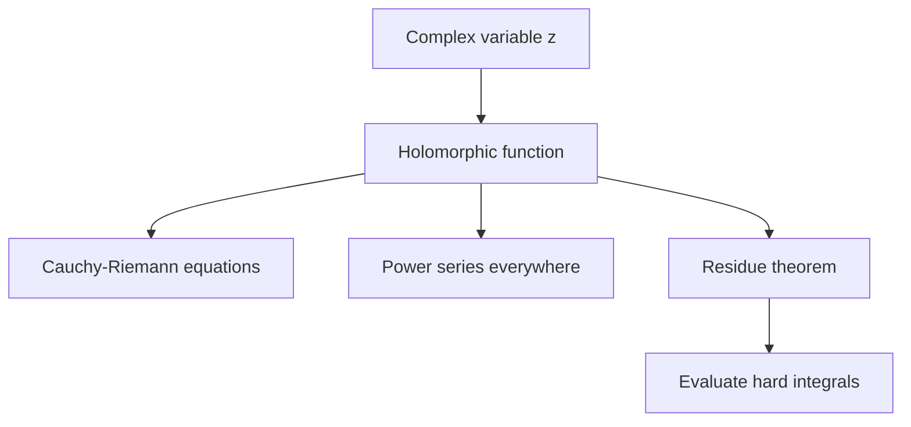
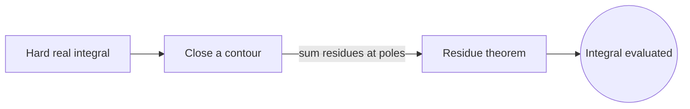
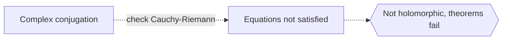

# Complex Analysis

## Overview

Complex analysis studies functions that take complex numbers as inputs and outputs. A complex number combines a real and an imaginary part, and functions of such numbers behave in startlingly rigid ways. The key concept is holomorphy, meaning a function is complex-differentiable in a region. This condition is far stronger than real differentiability. A single derivative existing forces the function to be infinitely differentiable and to equal its own power series everywhere it is defined.

It matters because that rigidity yields powerful, clean results. Contour integration lets you evaluate real integrals that resist ordinary methods. The residue theorem turns integrals into simple sums of local quantities. Complex analysis also underlies signal processing, fluid flow, and quantum theory. The recurring theme is that local information controls global behavior. Knowing a holomorphic function on a tiny disk determines it across its whole domain, a rigidity with no analog in real calculus.

### Quick Takeaways

- Holomorphic functions are complex-differentiable and hence infinitely smooth
- Local behavior of a holomorphic function determines it globally
- Contour integration and residues evaluate otherwise hard integrals

## Definition

- **Complex number** combines a real part and an imaginary part.
- **Holomorphic** means complex-differentiable throughout an open region.
- **Cauchy-Riemann equations** are the conditions linking the real and imaginary partial derivatives.
- **Contour integral** integrates a function along a path in the complex plane.
- **Residue** is the coefficient capturing a function's behavior near a singularity.
- **Analytic continuation** extends a function beyond its original domain uniquely.

## The Analogy

Imagine a hologram where every small fragment contains the whole image. Cut off a tiny corner and you can still reconstruct the full picture from it. Holomorphic functions behave this way. A tiny piece of the function encodes the entire function across its domain. Complex analysis is the study of this hologram-like rigidity, where knowing a little forces knowing everything.

## When You See It

- Evaluating tricky real integrals with the residue theorem
- Analyzing signals and filters through the frequency domain
- Modeling two-dimensional fluid flow and electrostatics
- Studying the Riemann zeta function and prime distribution
- Solving Laplace's equation with conformal maps
- Grounding transforms used across engineering

## Examples

**Good:** Using the residue theorem to evaluate a real definite integral by closing a contour in the complex plane. The integral reduces to summing residues at enclosed poles.

**Bad:** Assuming every function of a complex variable is holomorphic. Functions like complex conjugation fail the Cauchy-Riemann equations, so the powerful theorems do not apply.

## Important Points

- Complex differentiability is much stronger than real differentiability
- The Cauchy-Riemann equations characterize holomorphic functions
- A holomorphic function equals its Taylor series on any disk in its domain
- Cauchy's integral theorem makes contour integrals of holomorphic functions path independent
- Residues at singularities evaluate contour and many real integrals
- Analytic continuation extends functions uniquely, defining objects like the zeta function
- Conformal maps preserve angles and solve planar physics problems

## Summary

- Complex analysis studies functions of a complex variable.
- Holomorphy forces infinite smoothness and power-series equality.
- Local information determines the function globally.
- Contour integration and residues evaluate hard integrals.
- It underlies signal processing, physics, and number theory.
- _In complex analysis a tiny piece of a function encodes the whole of it._
