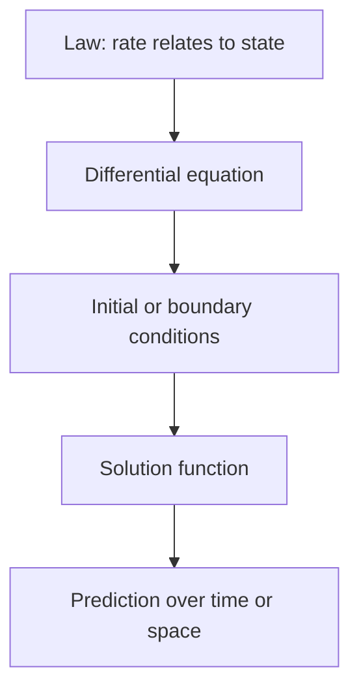

# Differential Equations

## Overview

A differential equation is an equation that connects an unknown function to its derivatives. Instead of solving for a number, you solve for a whole function that satisfies a relationship between its value and its rates of change. For example, a law might say the rate of growth is proportional to the current size, and solving the equation reveals the exponential function that obeys that law. The solution describes how a quantity evolves over time or space.

Differential equations matter because they are how science states its laws. Newton's laws, heat flow, population dynamics, circuits, and epidemics are all differential equations. The central challenge is that most cannot be solved with a neat formula. Only special classes have closed-form solutions, so much of the field is about classifying equations, proving that solutions exist and are unique, and approximating them numerically when exact answers are out of reach.

### Quick Takeaways

- A differential equation relates a function to its derivatives
- Its solution is a function describing how a system evolves
- Most have no closed form, so numerical methods are essential

## Definition

- **Differential equation** relates an unknown function to one or more of its derivatives.
- **Order** is the highest derivative that appears in the equation.
- **Linear** means the unknown and its derivatives appear only to the first power.
- **Initial condition** fixes the solution's value and derivatives at a starting point.
- **Boundary condition** fixes the solution's values at the edges of a region.
- **General solution** is the family of all functions satisfying the equation.

## The Analogy

Think of a recipe written in terms of change rather than fixed amounts. It does not tell you the temperature directly. It tells you how fast the temperature rises given the current temperature. Following that rule from a known starting point traces out the full temperature curve over time. A differential equation is such a rule of change, and solving it means reconstructing the whole story from the rule plus a starting point.

## When You See It

- Modeling motion under forces with Newton's laws
- Describing heat, diffusion, and wave propagation
- Tracking population growth and epidemic spread
- Analyzing electrical circuits and control systems
- Pricing options in financial mathematics
- Simulating fluids, weather, and chemical reactions

## Examples

**Good:** Modeling radioactive decay with an equation stating the rate of loss is proportional to the amount present. The solution is a clean exponential that matches measured decay closely.

**Bad:** Expecting a simple formula for a general nonlinear system like turbulent fluid flow. Such equations rarely have closed forms, so a formula-only approach fails and numerics are required.

## Important Points

- Order and linearity classify equations and predict which methods apply
- Initial or boundary conditions select one solution from the general family
- Existence and uniqueness theorems say when a well-posed solution exists
- Linear equations are far more tractable than nonlinear ones
- Ordinary equations involve one independent variable, partial equations involve several
- Most real equations require numerical solvers rather than closed forms
- Small changes in conditions can cause large changes in solutions for chaotic systems

## Summary

- A differential equation relates a function to its derivatives.
- Its solution is a function describing how a system evolves.
- Conditions pick one solution from the general family.
- Order and linearity determine which solving methods apply.
- Most equations need numerical approximation rather than formulas.
- _A differential equation is a rule of change, and solving it rebuilds the whole story._
