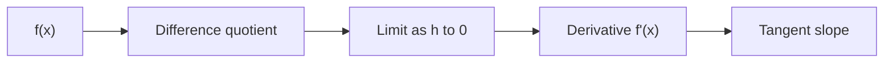
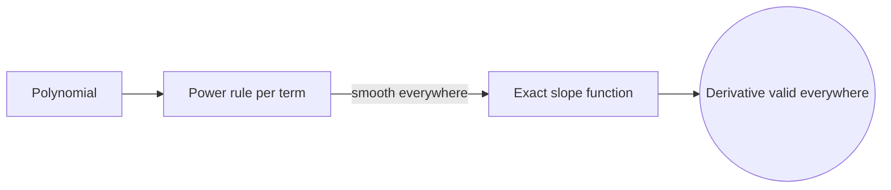

# Differentiation

## Overview

Differentiation is the operation that finds a derivative. The derivative of a function at a point is the instantaneous rate of change there, or equivalently the slope of the tangent line to the graph. It is defined as the limit of the average rate of change over an interval as that interval shrinks to zero. This limit captures how the output responds to the tiniest change in input, at one exact spot.

Differentiation matters because rates of change are everywhere. Velocity is the derivative of position, marginal cost is the derivative of total cost, and reaction rate is the derivative of concentration. The main tension is that differentiation demands smoothness. A function must have no corners, jumps, or vertical tangents at a point to be differentiable there. A set of rules, the chain, product, and quotient rules, makes the process mechanical for most functions you meet.

### Quick Takeaways

- The derivative is the instantaneous rate of change and the slope of the tangent
- It is defined as a limit of average rates over shrinking intervals
- Rules like chain, product, and quotient make differentiation mechanical



## Definition

- **Derivative** is the limit of the difference quotient as the interval shrinks to zero.
- **Difference quotient** is the average rate of change over a small interval.
- **Tangent line** is the straight line touching the curve with the derivative as its slope.
- **Differentiable** means the derivative exists, requiring local smoothness.
- **Chain rule** differentiates a composition by multiplying the outer and inner derivatives.
- **Higher derivative** is the derivative of a derivative, measuring change in the rate itself.

## The Analogy

Picture zooming into a smooth curve with a microscope. The more you magnify one point, the straighter the curve looks, until it is nearly a line. The slope of that line is the derivative. Differentiation is the act of zooming in until the curve flattens and reading off that slope. A curve with a sharp corner never flattens no matter how far you zoom, which is why it has no derivative there.

## When You See It

- Finding velocity and acceleration from a position function
- Locating maxima and minima where the derivative is zero
- Building tangent-line approximations for quick estimates
- Deriving marginal quantities in economics
- Setting up and solving differential equations
- Analyzing how sensitive an output is to a small input change

## Examples

**Good:** Differentiating a polynomial term by term with the power rule to get a clean, exact slope function. Each rule applies directly and the result holds everywhere.



**Bad:** Differentiating an absolute-value function at its corner and reporting a single slope. The left and right slopes disagree there, so no derivative exists at that point.

```mermaid
flowchart LR
  ABS["Absolute-value corner"] -.->|left slope| L["-1"]
  ABS -.->|right slope| R["+1"]
  L -.-> BAD{{Slopes disagree, no derivative}}
  R -.-> BAD

## Important Points

- Differentiability at a point requires the function to be continuous and smooth there
- Continuity does not imply differentiability, since corners are continuous but not smooth
- The chain rule handles compositions and is the workhorse of practical differentiation
- The product and quotient rules differentiate combined functions correctly
- Higher-order derivatives describe acceleration, curvature, and concavity
- Implicit differentiation finds slopes when the function is not solved for one variable
- A zero derivative marks a candidate extremum but needs a second test to classify it

## Summary

- Differentiation finds the derivative, the instantaneous rate of change.
- The derivative equals the slope of the tangent line at a point.
- It is defined as a limit of average rates over shrinking intervals.
- Chain, product, and quotient rules make the process mechanical.
- Differentiability requires smoothness, so corners and jumps block it.
- _Differentiation zooms in until the curve looks straight and reads its slope._
```
