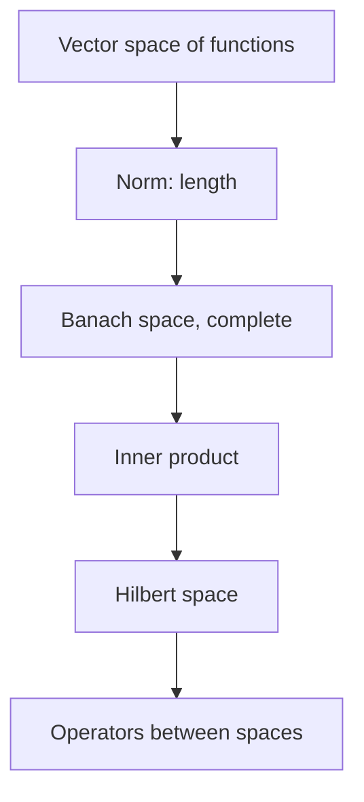

# Functional Analysis

## Overview

Functional analysis studies vector spaces whose elements are functions, along with the linear maps between them. It takes the familiar ideas of linear algebra, vectors, length, and linear transformations, and pushes them into infinite dimensions. A function becomes a point in an infinite-dimensional space, and a whole space of functions gets a notion of distance and length through a norm. This lets you treat questions about functions with geometric intuition.

It matters because so many problems in analysis are naturally about whole spaces of functions at once. Differential and integral equations, quantum mechanics, and optimization all live in these spaces. The central objects are Banach spaces, which are complete normed spaces, and Hilbert spaces, which add an inner product and hence angles and orthogonality. The recurring theme is that completeness plus geometry lets you prove that solutions exist and behave well even in infinite dimensions.

### Quick Takeaways

- Functions are treated as points in infinite-dimensional vector spaces
- Norms give length and distance, inner products give angles
- Banach and Hilbert spaces are the central complete settings

## Definition

- **Function space** is a vector space whose elements are functions.
- **Norm** assigns a length to each element, generalizing vector magnitude.
- **Banach space** is a normed space that is complete, with no missing limits.
- **Inner product** measures angles and defines orthogonality between functions.
- **Hilbert space** is a complete inner-product space.
- **Operator** is a linear map between function spaces.

## The Analogy

Think of ordinary space where each point is described by a few coordinates. Now imagine a point that needs infinitely many coordinates, one for each moment of a signal or each term of a series. That point is a whole function. Functional analysis is geometry in this infinite-coordinate space, where you can still speak of length, distance, and direction. It carries our spatial intuition into the realm of functions.

## When You See It

- Formulating quantum mechanics in Hilbert space
- Proving existence of solutions to differential and integral equations
- Analyzing convergence in Fourier and wavelet expansions
- Studying signal spaces and transforms rigorously
- Grounding optimization in infinite-dimensional settings
- Defining generalized functions and distributions

## Examples

**Good:** Representing quantum states as unit vectors in a Hilbert space and observables as operators. The inner product gives probabilities and orthogonality separates distinct states cleanly.

**Bad:** Assuming every intuition from finite dimensions carries over unchanged. In infinite dimensions the closed unit ball is not compact, so naive finite-dimensional arguments can fail.

## Important Points

- Functional analysis extends linear algebra to infinite-dimensional function spaces
- A norm gives length and distance, enabling geometric reasoning
- Banach spaces are complete, guaranteeing limits of Cauchy sequences exist
- Hilbert spaces add an inner product, giving angles and orthogonal bases
- Operators generalize matrices, and their spectra generalize eigenvalues
- Key theorems include Hahn-Banach, open mapping, and the uniform boundedness principle
- Infinite dimensions break some finite-dimensional intuitions, like compactness of bounded sets

## Summary

- Functional analysis studies infinite-dimensional spaces of functions.
- Norms give length and distance, inner products give angles.
- Banach and Hilbert spaces are the central complete settings.
- Operators generalize matrices to these infinite dimensions.
- It grounds quantum mechanics, PDEs, and modern analysis.
- _Functional analysis carries the geometry of space into the world of functions._
