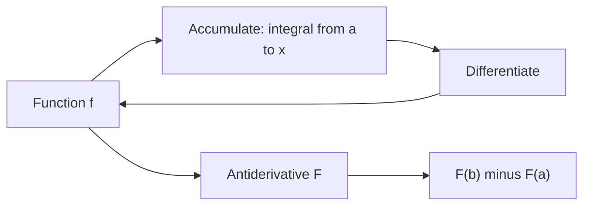

# Fundamental Theorem of Calculus

## Overview

The fundamental theorem of calculus is the bridge between the two halves of calculus. It says that integration and differentiation undo each other. The first part states that if you accumulate a function's values from a fixed point, then differentiate that accumulation, you recover the original function. The second part states that you can compute a definite integral by finding an antiderivative and subtracting its values at the endpoints. This turns area problems into simple evaluation.

The theorem matters because it makes integration practical. Without it, every integral would require summing infinitely many thin slices by hand. With it, you find one antiderivative and plug in two numbers. The deeper significance is conceptual. Rates and totals, which seem like separate ideas, are two views of the same relationship. Local behavior, the derivative, controls global accumulation, the integral.

### Quick Takeaways

- Differentiation and integration are inverse operations
- Part one recovers a function by differentiating its accumulated area
- Part two computes a definite integral from an antiderivative at the endpoints

## Definition

- **Definite integral** is the signed area under a curve between two fixed limits.
- **Antiderivative** is a function whose derivative equals the original function.
- **Accumulation function** is the integral from a fixed start up to a variable endpoint.
- **First part** says the derivative of the accumulation function returns the integrand.
- **Second part** says the definite integral equals the antiderivative evaluated at the endpoints.
- **Continuity** of the integrand is the condition that makes the theorem hold cleanly.

## The Analogy

Think of filling a bathtub. The flow rate from the tap is the derivative, and the water level in the tub is the integral of that flow. If you know the level at every moment, its rate of rise tells you the flow, which is the first part. If you know the flow over time, subtracting the starting level from the ending level tells you total water added, which is the second part. Level and flow are one story told two ways.

## When You See It

- Evaluating a definite integral by finding an antiderivative
- Recovering a rate from a measured cumulative total
- Proving that area and slope are linked in physics problems
- Solving differential equations by integrating a known rate
- Computing displacement from a velocity function over time
- Justifying numerical integration against exact antiderivative results

## Examples

**Good:** Computing the area under a parabola by finding its antiderivative and subtracting endpoint values. One antiderivative and two substitutions replace an infinite sum of slices.

**Bad:** Applying the second part to an integrand that has a jump discontinuity in the interval. The theorem assumes continuity, so the endpoint subtraction can give a wrong area.

## Important Points

- The theorem requires the integrand to be continuous on the interval for the clean form
- The first part builds an antiderivative directly from the integral itself
- The second part reduces area computation to endpoint evaluation of an antiderivative
- Antiderivatives differ by a constant, which cancels in the endpoint subtraction
- It generalizes to line integrals and the divergence and Stokes theorems in higher dimensions
- It fails at points where the function is not continuous, so those must be handled separately
- The result is why symbolic integration tables are so useful in practice

## Summary

- The theorem links differentiation and integration as inverse operations.
- Part one says differentiating an accumulation recovers the original function.
- Part two computes a definite integral from an antiderivative at the endpoints.
- Continuity of the integrand is the condition that makes it hold.
- It turns infinite summation into a two-value subtraction.
- _Rates and totals are one relationship seen from opposite ends._
