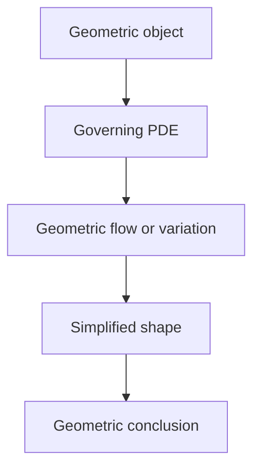
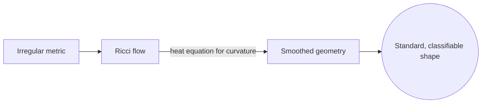
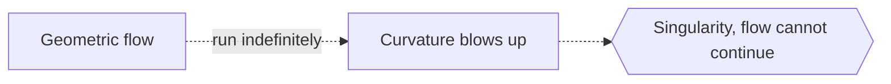

# Geometric Analysis

## Overview

Geometric analysis studies geometric objects like curves, surfaces, and higher-dimensional manifolds using the tools of analysis, especially partial differential equations. Instead of treating shape with pure geometry, it writes geometric quantities such as curvature as solutions to differential equations, then applies analytic techniques to extract geometric conclusions. The field blends differential geometry, PDE theory, and the calculus of variations into one approach.

It matters because many deep geometric questions turn out to be questions about equations. Minimal surfaces, which are shapes of least area like soap films, satisfy a specific PDE. Geometric flows, such as the Ricci flow that famously helped prove the Poincare conjecture, evolve a shape over time by a differential equation until it simplifies. The recurring theme is using analysis to smooth, evolve, or optimize a shape and reading off geometric truths from the result.

### Quick Takeaways

- Geometry is studied through differential equations and analysis
- Curvature and shape become solutions of PDEs
- Geometric flows evolve shapes to reveal underlying structure

## Definition

- **Manifold** is a space that looks locally like flat Euclidean space.
- **Curvature** measures how a space or surface bends away from flat.
- **Minimal surface** is a surface of locally least area, satisfying a specific PDE.
- **Geometric flow** evolves a shape over time by a differential equation.
- **Ricci flow** is a flow that evolves a metric to smooth out curvature.
- **Calculus of variations** finds shapes that minimize or maximize a quantity.

## The Analogy

Picture a crumpled sheet of foil that you slowly heat so it relaxes toward a smoother form. The rule for how each point moves as it relaxes is a differential equation, and the final smooth shape reveals the sheet's true underlying form. Geometric analysis is the mathematics of such controlled smoothing, using evolution equations to iron out a shape until its essential geometry stands clear.

## When You See It

- Finding minimal surfaces like soap films spanning a wire loop
- Evolving shapes with curvature flows to simplify them
- Proving major results like the Poincare conjecture via Ricci flow
- Studying how curvature constrains the global shape of a space
- Optimizing shapes in the calculus of variations
- Modeling interfaces and phase boundaries in physics

## Examples

**Good:** Using Ricci flow to smooth an irregular metric on a manifold until its geometry becomes standard and classifiable. The flow acts like a heat equation for curvature, evening out bumps.

**Bad:** Assuming every geometric flow runs forever without trouble. Flows can develop singularities where curvature blows up, so they need careful surgery or analysis to continue.

## Important Points

- Geometric analysis expresses shape and curvature through PDEs
- Minimal surfaces minimize area and satisfy a mean-curvature equation
- Geometric flows can develop singularities that require special handling
- Ricci flow smooths curvature much as heat flow smooths temperature
- The calculus of variations underlies many shape-optimization problems
- Curvature bounds constrain the possible global topology of a space
- The field unites differential geometry, PDE theory, and variational methods

## Summary

- Geometric analysis studies shape using analysis and PDEs.
- Curvature and geometry become solutions of differential equations.
- Minimal surfaces and geometric flows are central objects.
- Ricci flow smooths curvature and proved the Poincare conjecture.
- Flows may form singularities that demand careful treatment.
- _Geometric analysis irons a shape with equations until its true form shows._
