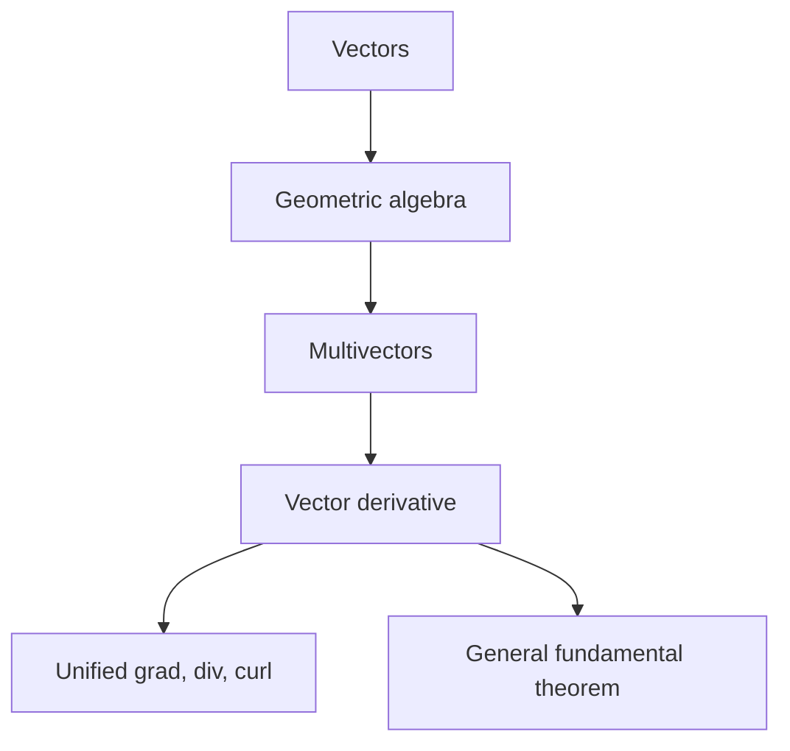
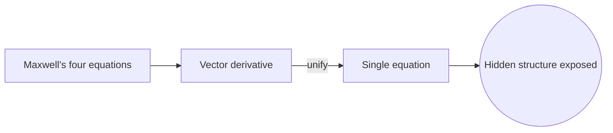

# Geometric Calculus

## Overview

Geometric calculus is calculus done in the language of geometric algebra. Geometric algebra extends vectors with a product that combines dot and wedge products, producing objects called multivectors that represent points, lines, planes, and volumes uniformly. Geometric calculus adds a single differential operator, the vector derivative, that acts on functions of these multivectors. This one operator absorbs the gradient, divergence, and curl of vector calculus into a unified whole.

It matters because it simplifies and generalizes. In ordinary vector calculus, divergence and curl are separate operations that only work cleanly in three dimensions. Geometric calculus treats them as parts of one derivative that works in any dimension. Its fundamental theorem generalizes Green's, Stokes', and the divergence theorems into a single statement. The tension is that its abstraction has a learning curve, and it is less widely taught than standard vector calculus.

### Quick Takeaways

- It builds calculus on geometric algebra and multivectors
- One vector derivative unifies gradient, divergence, and curl
- A single fundamental theorem generalizes the classic integral theorems

## Definition

- **Geometric algebra** extends vectors with a product mixing dot and wedge parts.
- **Multivector** is a general element combining scalars, vectors, planes, and volumes.
- **Geometric product** is the associative product that underlies the whole algebra.
- **Vector derivative** is the single operator that generalizes gradient, divergence, and curl.
- **Blade** is a multivector representing an oriented subspace like a plane or volume.
- **Fundamental theorem** relates the integral of a derivative to boundary values in any dimension.

## The Analogy

Think of vector calculus as a toolbox with separate wrenches for divergence, curl, and gradient, each shaped for a specific bolt in three dimensions. Geometric calculus is a single adjustable wrench that fits every one of those bolts and works in any number of dimensions. You carry one tool instead of many, and it adapts to the job rather than forcing you to pick the right specialized piece.

## When You See It

- Reformulating electromagnetism as a single equation
- Handling rotations cleanly with rotors instead of matrices
- Doing physics and geometry in dimensions above three
- Unifying gradient, divergence, and curl in one framework
- Modeling spacetime in relativity with spacetime algebra
- Simplifying computer graphics and robotics rotation math

## Examples

**Good:** Writing Maxwell's four equations as one geometric-calculus equation using the vector derivative. The unified form exposes structure that the split vector-calculus version hides.

**Bad:** Reaching for geometric calculus to solve a routine one-variable derivative problem. The heavy machinery adds overhead with no benefit over ordinary calculus there.

## Important Points

- Geometric algebra unifies dot and cross product ideas through the geometric product
- Multivectors represent oriented subspaces, not just arrows in space
- The single vector derivative contains gradient, divergence, and curl as parts
- Its fundamental theorem generalizes Green's, Stokes', and the divergence theorems
- It works in any dimension, unlike the curl which is special to three dimensions
- Rotors handle rotations without gimbal lock or matrix bookkeeping
- Its main cost is a steeper learning curve and less common tooling

## Summary

- Geometric calculus is calculus in the language of geometric algebra.
- Multivectors represent points, lines, planes, and volumes uniformly.
- One vector derivative unifies gradient, divergence, and curl.
- A single fundamental theorem generalizes the classic integral theorems.
- It works in any dimension but has a steeper learning curve.
- _Geometric calculus replaces a drawer of special tools with one that fits every dimension._
