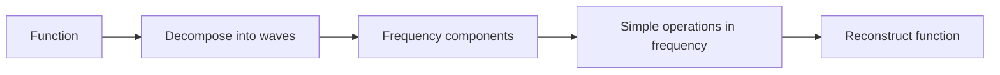
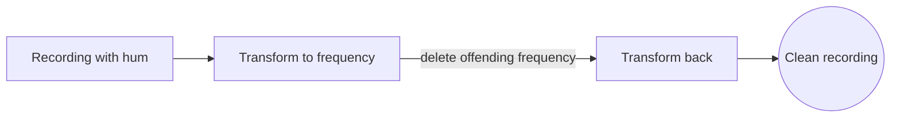

# Harmonic Analysis

## Overview

Harmonic analysis studies how general functions can be built from simple oscillating pieces like sines and cosines. The founding idea is that a complicated signal can be decomposed into a sum or integral of pure waves, each with its own frequency and strength. Fourier series do this for periodic functions and the Fourier transform does it for general ones. Harmonic analysis is the broad theory of these decompositions and the operators that act on them.

It matters because frequency is often the natural way to understand a signal or a function. Many operations that look tangled in the original domain become simple multiplication in the frequency domain. The field extends far beyond the real line to groups, spheres, and abstract spaces, always asking the same question, what are the natural basic waves here and how do functions decompose into them. The deep tension is convergence, whether these decompositions truly reconstruct the original.

### Quick Takeaways

- Functions decompose into sums or integrals of simple waves
- Frequency-domain views turn hard operations into multiplication
- The theory generalizes far beyond the real line to groups and spheres

## Definition

- **Harmonic analysis** studies decomposing functions into basic oscillating components.
- **Fourier series** expands a periodic function into sines and cosines.
- **Fourier transform** decomposes a general function into a continuum of frequencies.
- **Frequency** is the rate of oscillation of a basic wave component.
- **Convolution** is an operation that becomes multiplication in the frequency domain.
- **Harmonic** is a basic building-block wave, like a single sine tone.

## The Analogy

Think of a musical chord. Your ear hears one blended sound, but it is really several pure notes played together. A trained musician can name each note and its loudness. Harmonic analysis is the mathematics of doing this for any signal, breaking a complex sound or function into its pure tones and their strengths, then studying and reassembling it from those parts.

## When You See It

- Decomposing signals into frequencies for audio and image processing
- Solving differential equations by transforming to the frequency domain
- Compressing data by discarding small frequency components
- Studying symmetry through analysis on groups
- Analyzing quantum states and wavefunctions
- Filtering noise by removing unwanted frequency bands

## Examples

**Good:** Removing hum from a recording by transforming to the frequency domain, deleting the offending frequency, and transforming back. The problem is trivial in frequency but messy in time.

**Bad:** Expecting a Fourier series of a discontinuous square wave to converge neatly at the jump. It overshoots near the discontinuity, the Gibbs phenomenon, so naive pointwise expectations fail.

## Important Points

- Fourier series handle periodic functions, the Fourier transform handles general ones
- Convolution in one domain is multiplication in the other, a central simplification
- Convergence of these decompositions is subtle and depends on the function's smoothness
- The Gibbs phenomenon causes overshoot near discontinuities
- Harmonic analysis extends to abstract groups, unifying many settings
- Wavelets add localized, multi-scale alternatives to pure frequencies
- The uncertainty principle limits joint sharpness in time and frequency

## Summary

- Harmonic analysis decomposes functions into simple waves.
- Fourier series and transforms are its foundational tools.
- Frequency-domain views simplify convolution and differentiation.
- Convergence of decompositions is a central, subtle question.
- The theory generalizes to groups, spheres, and abstract spaces.
- _Harmonic analysis hears any function as a chord of pure tones._
