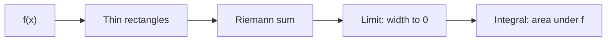
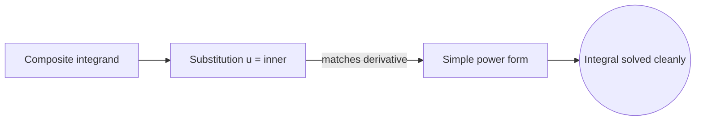

# Integration

## Overview

Integration is the operation that finds an integral. A definite integral is the signed area under a curve between two limits, built as the limit of a sum of many thin rectangles. As the rectangles get thinner and more numerous, their total area converges to the exact value. This is why integration is described as continuous summation. It adds up infinitely many infinitesimal pieces into one finite total.

Integration matters because accumulation is as common as change. Total distance from a speed, total charge from a current, and total probability from a density are all integrals. The main challenge is that integration is harder than differentiation. Every elementary function has a derivative in closed form, but many have no elementary antiderivative. Techniques like substitution, integration by parts, and partial fractions, plus numerical methods, fill that gap.

### Quick Takeaways

- The definite integral is the signed area under a curve between two limits
- It is defined as a limit of sums of thin rectangles
- Many functions lack an elementary antiderivative, so methods and numerics matter

## Definition

- **Definite integral** is the signed area under a curve between two fixed limits.
- **Riemann sum** is a finite sum of rectangle areas approximating the integral.
- **Indefinite integral** is the family of antiderivatives of a function.
- **Integrand** is the function being integrated.
- **Substitution** reverses the chain rule to simplify an integral.
- **Integration by parts** reverses the product rule to split a hard integral.

## The Analogy

Imagine measuring the water in an oddly shaped pond by slicing it into thin vertical strips. Each strip is nearly a rectangle, so you can estimate its volume easily. Add up all the strips and you approximate the whole pond. Make the strips thinner and the estimate sharpens toward the true volume. Integration is this slice-and-sum process taken to the limit of infinitely thin slices.

## When You See It

- Computing area, volume, and arc length of curved shapes
- Finding total distance traveled from a velocity function
- Turning a probability density into a cumulative probability
- Calculating work, charge, or mass from a rate over a region
- Averaging a continuously varying quantity over an interval
- Solving differential equations by integrating known rates

## Examples

**Good:** Using substitution to turn a composite integrand into a simple power, then integrating cleanly. The substitution matches the inner function and its derivative, so the integral simplifies exactly.

**Bad:** Trying to force an elementary antiderivative for a Gaussian bell curve. No elementary form exists, so the attempt fails and a numerical or special-function approach is needed.

## Important Points

- The definite integral gives a number, the indefinite integral gives a family of functions
- Integration is defined as a limit of Riemann sums of thin rectangles
- The fundamental theorem lets antiderivatives compute definite integrals directly
- Substitution and integration by parts reverse the chain and product rules
- Partial fractions break rational integrands into simple summable pieces
- Many functions have no elementary antiderivative, so numerical methods are essential
- Improper integrals extend the idea to infinite limits or unbounded integrands

## Summary

- Integration finds the integral, a continuous sum of infinitesimal pieces.
- The definite integral is the signed area under a curve between two limits.
- It is defined as a limit of Riemann sums of thin rectangles.
- The fundamental theorem connects it to antiderivatives for easy computation.
- Many functions need special methods or numerics since no elementary form exists.
- _Integration slices a region into infinitely thin pieces and sums them exactly._
