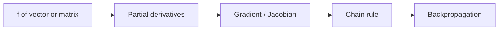

# Matrix Calculus

## Overview

Matrix calculus is a compact notation for taking derivatives when the inputs and outputs are vectors or matrices instead of single numbers. Rather than writing out thousands of individual partial derivatives, it organizes them into gradients, Jacobians, and matrix-valued derivatives. This lets you differentiate expressions like a quadratic form or a matrix product in one clean step, using rules that mirror ordinary calculus but respect vector and matrix shapes.

It matters enormously in machine learning and optimization, where models have millions of parameters arranged in matrices. Backpropagation is matrix calculus applied through a chain of layers. The main source of confusion is layout convention. Derivatives can be arranged in numerator layout or denominator layout, and mixing them produces transposed, wrong results. Fixing one convention up front is the key to using matrix calculus without errors.

### Quick Takeaways

- It differentiates vector and matrix expressions using compact notation
- Gradients and Jacobians organize many partial derivatives at once
- Layout convention must be fixed to avoid transposed mistakes

## Definition

- **Gradient** is the vector of partial derivatives of a scalar function of a vector.
- **Jacobian** is the matrix of partial derivatives of a vector function of a vector.
- **Numerator layout** arranges derivatives with the output index as rows.
- **Denominator layout** arranges derivatives with the input index as rows.
- **Matrix derivative** differentiates an expression with respect to a whole matrix.
- **Chain rule** composes derivatives through layered functions as matrix products.

## The Analogy

Think of a spreadsheet of rates of change. If you have many outputs each depending on many inputs, you could track every input-output rate on its own sticky note. That is a mess. Matrix calculus is like laying all those sticky notes into one organized grid, so a single grid operation replaces hundreds of separate ones. The grid keeps the rates aligned so the chain rule becomes a tidy multiplication.

## When You See It

- Deriving gradients for training neural networks
- Solving least-squares and regression in closed form
- Optimizing quadratic forms and cost functions
- Implementing backpropagation through layered models
- Computing sensitivities in control and signal processing
- Differentiating log-likelihoods in statistics

## Examples

**Good:** Differentiating a quadratic form to get a clean gradient in one step, then setting it to zero to solve least squares. The matrix rule replaces a long sum of partials with a single expression.

**Bad:** Mixing numerator and denominator layouts within one derivation. The mismatched conventions leave stray transposes, so the final gradient has the wrong shape.

## Important Points

- Matrix calculus packages many partial derivatives into gradients and Jacobians
- Numerator and denominator layouts differ by a transpose, so pick one and keep it
- The chain rule becomes a product of Jacobians read in the right order
- Common identities exist for quadratic forms, traces, and determinants
- The gradient of a scalar cost with respect to a matrix has the matrix's shape
- Backpropagation is repeated application of the matrix chain rule across layers
- Verifying a derivative numerically catches layout and sign mistakes quickly

## Summary

- Matrix calculus differentiates vector and matrix expressions compactly.
- Gradients and Jacobians organize many partial derivatives together.
- The chain rule becomes ordered matrix multiplication.
- A fixed layout convention prevents transposed, wrong answers.
- It is the engine behind neural network training and least squares.
- _Matrix calculus turns a swarm of partial derivatives into one clean grid operation._
