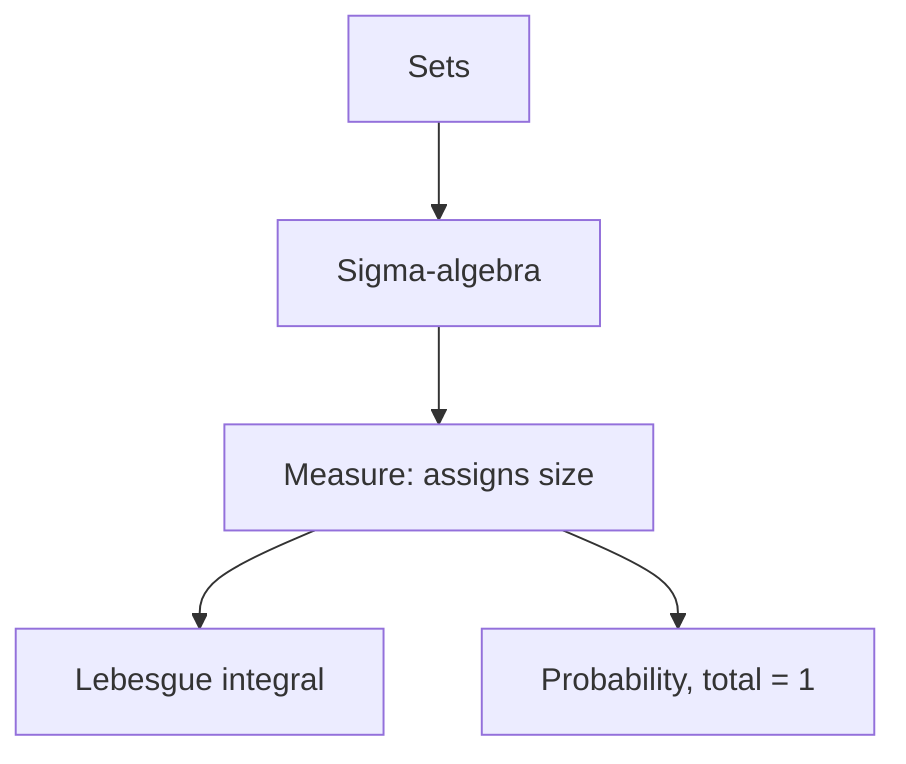

# Measure Theory

## Overview

Measure theory is the rigorous mathematics of size. It defines how to assign a consistent number, a measure, to sets, generalizing length, area, volume, and probability. The core problem it solves is that you cannot sensibly assign a size to every possible set without contradictions. So measure theory carefully restricts attention to a well-behaved family of measurable sets, called a sigma-algebra, and defines the measure only on those. This foundation makes integration and probability airtight.

It matters because it repairs the weaknesses of the older Riemann integral and builds modern probability. The Lebesgue integral, defined through measure theory, integrates far more functions and behaves well under limits, so you can swap limits and integrals under clear conditions. Probability theory is measure theory in disguise, where the total measure is one and events are measurable sets. The recurring theme is handling the infinite and the irregular without paradox.

### Quick Takeaways

- A measure assigns consistent size to a restricted family of measurable sets
- The Lebesgue integral generalizes the Riemann integral and handles limits well
- Probability is measure theory with total measure one

## Definition

- **Measure** assigns a nonnegative size to sets, generalizing length and area.
- **Sigma-algebra** is the family of measurable sets closed under complements and countable unions.
- **Measurable function** is one whose preimages of intervals are measurable sets.
- **Lebesgue integral** integrates by partitioning the range rather than the domain.
- **Almost everywhere** means a property holds except on a set of measure zero.
- **Probability measure** is a measure whose total is exactly one.

## The Analogy

Think of weighing sand poured onto a scale. Length-based methods slice the ground into strips and measure heights, which is the Riemann way. Measure theory instead groups together all the sand at the same height, no matter where it sits, and weighs each level. This grouping by value rather than position is exactly the Lebesgue idea, and it copes with sand scattered in wildly irregular patterns.

## When You See It

- Building probability theory on a rigorous foundation
- Defining the Lebesgue integral for badly behaved functions
- Justifying when limits and integrals can be exchanged
- Handling infinite-dimensional and function spaces
- Proving laws of large numbers and central limit results
- Analyzing sets of measure zero that Riemann integration ignores

## Examples

**Good:** Using the dominated convergence theorem to swap a limit and a Lebesgue integral under a shared bound. Measure theory guarantees the exchange gives the correct value.

**Bad:** Trying to Riemann-integrate a function that is one on the rationals and zero elsewhere. It is not Riemann integrable, yet its Lebesgue integral is cleanly zero since the rationals have measure zero.

## Important Points

- Not every set can be measured, so a sigma-algebra restricts to measurable ones
- Sets of measure zero are negligible, which formalizes almost everywhere statements
- The Lebesgue integral partitions the range, handling more functions than Riemann
- Convergence theorems let limits and integrals swap under clear conditions
- Probability is a measure of total size one, with events as measurable sets
- Measures can be finite, infinite, or signed depending on the setting
- The construction avoids paradoxes that arise from measuring arbitrary sets

## Summary

- Measure theory is the rigorous mathematics of size.
- A sigma-algebra restricts attention to well-behaved measurable sets.
- The Lebesgue integral generalizes Riemann and handles limits well.
- Sets of measure zero are negligible, enabling almost everywhere reasoning.
- Probability theory is measure theory with total measure one.
- _Measure theory assigns size to sets carefully enough to avoid every paradox._
