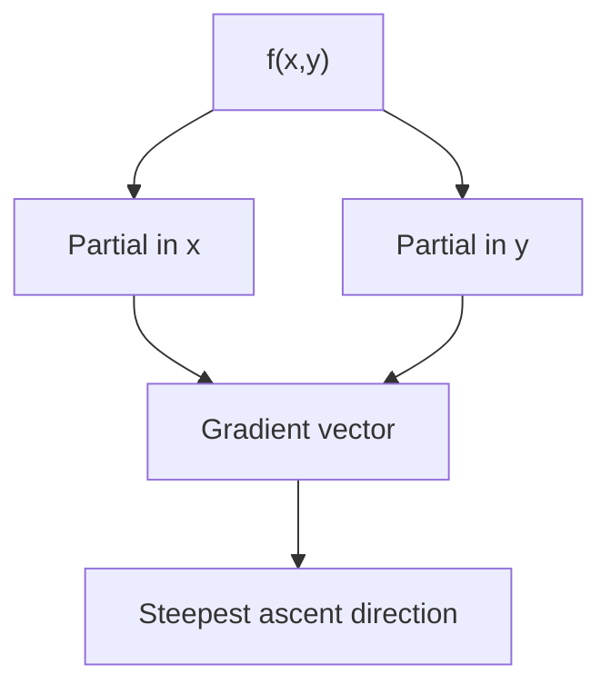
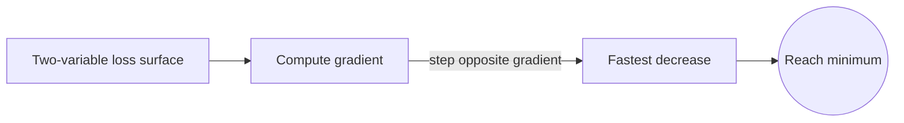

# Multivariable Calculus

## Overview

Multivariable calculus extends single-variable calculus to functions that depend on more than one input. Instead of a curve, you work with surfaces and higher-dimensional shapes. The derivative splits into partial derivatives, each measuring change along one input direction while holding the others fixed. The gradient collects these partials into a vector that points in the direction of steepest increase. Integration becomes summation over areas, volumes, and general regions.

It matters because most real systems depend on many variables at once. Temperature varies across a plate in two directions, and a cost depends on several inputs. Single-variable tools cannot capture how these interact. The central new idea is direction. In one dimension you can only go left or right, but in higher dimensions change depends on which way you move, which is exactly what the gradient and directional derivative describe.

### Quick Takeaways

- Partial derivatives measure change along one input while holding the others fixed
- The gradient points in the direction of steepest increase
- Integration extends to areas, volumes, and general regions

## Definition

- **Partial derivative** is the rate of change along one variable with the rest held fixed.
- **Gradient** is the vector of all partial derivatives, pointing toward steepest increase.
- **Directional derivative** is the rate of change along an arbitrary chosen direction.
- **Multiple integral** sums a function over a two or higher dimensional region.
- **Jacobian** is the matrix of partial derivatives of a vector-valued function.
- **Hessian** is the matrix of second partial derivatives describing curvature.

## The Analogy

Imagine standing on a hilly landscape described by height as a function of your east and north position. A partial derivative is the slope you feel if you walk due east only. The gradient is the compass direction of the steepest climb, and its length is how steep that climb is. Walking any other direction gives a slope between the extremes. Multivariable calculus is the math of reading slopes and areas on that full landscape.

## When You See It

- Optimizing functions of several inputs in machine learning and economics
- Computing volumes and masses over regions with multiple integrals
- Describing heat, fluid, and field behavior across space
- Finding steepest-ascent directions with the gradient
- Changing coordinates using the Jacobian determinant
- Classifying critical points with the Hessian matrix

## Examples

**Good:** Using the gradient to guide gradient descent toward a minimum of a two-variable loss surface. Each step moves opposite the gradient, the direction of fastest decrease.

**Bad:** Treating a partial derivative as the total change when all variables move together. Ignoring the other directions misses cross effects and gives the wrong overall rate.

## Important Points

- Partial derivatives hold all but one variable fixed, isolating one direction of change
- The gradient points toward steepest increase and is perpendicular to level sets
- The directional derivative is the gradient dotted with a chosen unit direction
- Multiple integrals compute totals over areas and volumes, order of integration can be swapped under mild conditions
- The Jacobian handles coordinate changes and scales areas and volumes
- The Hessian classifies critical points as minima, maxima, or saddles
- Mixed partial derivatives are equal when the function is smooth enough

## Summary

- Multivariable calculus extends calculus to functions of several inputs.
- Partial derivatives measure change along one direction at a time.
- The gradient collects them and points toward steepest increase.
- Integration generalizes to areas, volumes, and general regions.
- Direction becomes central, since change depends on which way you move.
- _With many inputs, the question is not only how much changes but in which direction._
