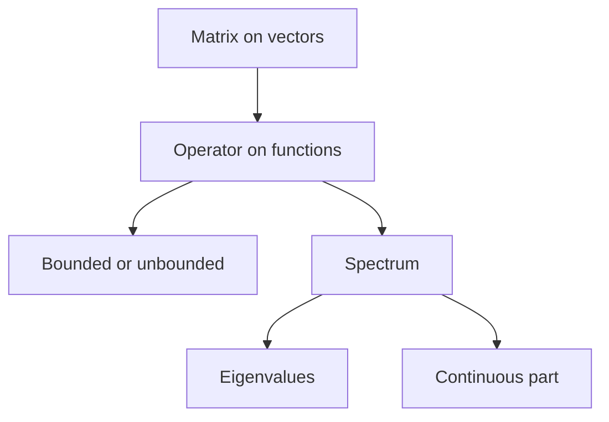
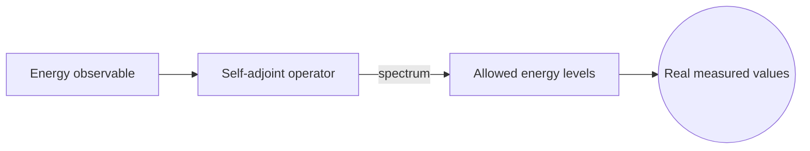
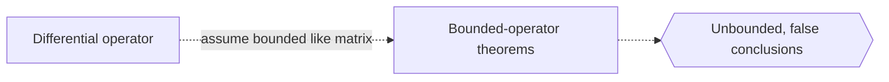

# Operator Theory

## Overview

Operator theory studies linear operators, which are linear maps acting on vector spaces of functions, usually infinite-dimensional Banach or Hilbert spaces. An operator generalizes a matrix. Just as a matrix transforms finite vectors, an operator transforms functions, for example by differentiating them, integrating them, or multiplying by another function. Operator theory asks how these transformations behave, whether they can be inverted, and what their characteristic values are.

It matters because the central objects of physics and analysis are operators. In quantum mechanics, every observable is an operator whose spectrum gives the possible measured values. Differential equations are statements about differential operators. The heart of the theory is the spectrum, the generalization of eigenvalues to infinite dimensions. Unlike matrices, operators can have continuous spectra, not just isolated eigenvalues, and this richer structure is exactly what physical systems require.

### Quick Takeaways

- Operators generalize matrices to infinite-dimensional function spaces
- The spectrum generalizes eigenvalues and can be continuous
- Observables in quantum mechanics are operators with physical spectra

## Definition

- **Linear operator** is a linear map from one function space to another.
- **Bounded operator** maps bounded sets to bounded sets, controlled by a norm.
- **Unbounded operator** lacks that control, common for differential operators.
- **Spectrum** is the set of values generalizing eigenvalues of an operator.
- **Self-adjoint operator** equals its own adjoint and has real spectrum.
- **Adjoint** is the operator analog of the conjugate transpose of a matrix.

## The Analogy

Think of a machine on an assembly line that takes an object in and gives a transformed object out, the same way every time and respecting combinations. Feed it two blended inputs and the output is the same blend of the two separate outputs. That predictable, blend-respecting machine is a linear operator. Operator theory studies the machines that act not on physical parts but on entire functions, asking what they do and undo.

## When You See It

- Representing quantum observables and their measurable spectra
- Analyzing differential operators in PDE theory
- Studying integral operators and their invertibility
- Building the spectral theory behind Fourier analysis
- Modeling time evolution with operator semigroups
- Investigating stability through an operator's spectrum

## Examples

**Good:** Treating the quantum energy observable as a self-adjoint operator whose spectrum gives the allowed energy levels. Self-adjointness guarantees those measured values are real.

**Bad:** Assuming a differential operator is bounded like a matrix. Differentiation is unbounded, so applying bounded-operator theorems to it without care gives false conclusions.

## Important Points

- Operators generalize matrices to infinite-dimensional spaces of functions
- The spectrum extends eigenvalues and may include a continuous part
- Bounded operators are tame, while differential operators are typically unbounded
- Self-adjoint operators have real spectra, matching physical measurements
- The spectral theorem diagonalizes self-adjoint operators like symmetric matrices
- The adjoint generalizes the conjugate transpose and defines key operator classes
- Compact operators behave most like matrices, with discrete eigenvalues

## Summary

- Operator theory studies linear operators on function spaces.
- Operators generalize matrices to infinite dimensions.
- The spectrum generalizes eigenvalues and can be continuous.
- Self-adjoint operators have real spectra and a spectral theorem.
- It provides the mathematical language of quantum mechanics.
- _An operator is a matrix grown up to act on whole functions instead of vectors._
