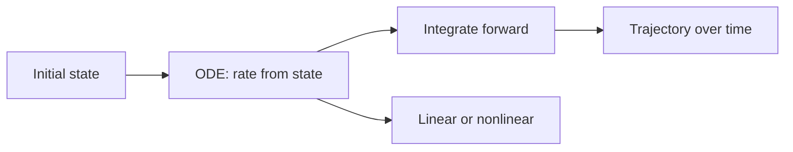

# Ordinary Differential Equations

## Overview

An ordinary differential equation, or ODE, involves an unknown function of a single independent variable and its ordinary derivatives. Because there is only one variable, usually time, an ODE describes how a single quantity or a coupled set of quantities evolves along one dimension. A first-order ODE fixes the rate of change from the current state. Higher-order ODEs involve acceleration and beyond. Given a starting state, the equation traces the entire future trajectory.

ODEs matter because they model countless dynamic systems that depend on one variable. A swinging pendulum, a cooling cup of coffee, and a growing population are all ODE problems. The main organizing idea is the initial value problem, where you know the state now and integrate forward. Linear ODEs enjoy powerful solution techniques and superposition, while nonlinear ODEs often need qualitative analysis or numerical solvers because closed forms are rare.

### Quick Takeaways

- An ODE involves one independent variable, usually time
- An initial state determines the full trajectory forward
- Linear ODEs are solvable in closed form far more often than nonlinear ones

## Definition

- **Ordinary differential equation** relates a function of one variable to its derivatives.
- **Order** is the highest derivative appearing in the equation.
- **Initial value problem** pairs an ODE with the state at a starting point.
- **Linear ODE** has the unknown and its derivatives only to the first power.
- **System of ODEs** couples several unknown functions of the same variable.
- **Equilibrium** is a state where the rate of change is zero.

## The Analogy

Imagine a marble rolling in a bowl. Its acceleration depends on where it sits on the slope, and that dependence is an ODE. If you know the marble's starting position and speed, the equation determines every later position without guessing. Solving the ODE is like releasing the marble and watching physics play out the one and only path allowed by the rule and the starting nudge.

## When You See It

- Modeling motion of pendulums, springs, and projectiles
- Describing exponential growth, decay, and cooling
- Analyzing electrical circuits with resistors and capacitors
- Tracking chemical reaction rates over time
- Simulating predator and prey population dynamics
- Studying stability of equilibria in control systems

## Examples

**Good:** Solving a linear first-order ODE for cooling with an integrating factor to get an exact exponential approach to room temperature. The linear structure makes a clean closed-form solution possible.

**Bad:** Assuming a general nonlinear ODE like the full pendulum equation has a simple elementary solution. Its exact solution needs special functions or numerics, so a naive formula guess is wrong.

## Important Points

- The order of an ODE sets how many initial conditions are needed
- Linear ODEs allow superposition, so solutions add and scale
- An initial value problem has a unique solution under mild smoothness conditions
- Nonlinear ODEs often require phase-plane analysis or numerical solvers
- Equilibria can be stable, unstable, or saddle-like, shaping long-term behavior
- Systems of ODEs model coupled quantities evolving together
- Numerical methods like Runge-Kutta approximate solutions step by step

## Summary

- An ODE involves a function of one variable and its derivatives.
- An initial state determines the entire trajectory forward.
- Linear ODEs allow superposition and often closed forms.
- Nonlinear ODEs usually need qualitative or numerical analysis.
- Equilibria and their stability describe long-term behavior.
- _An ODE plus a starting state fixes one path, and integrating reveals it._
