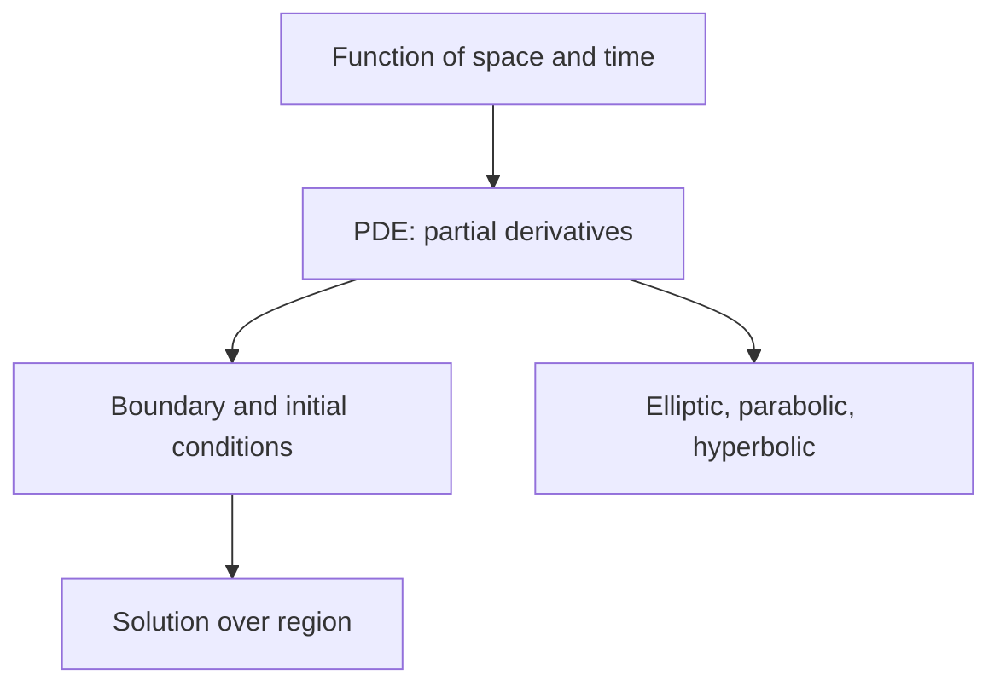
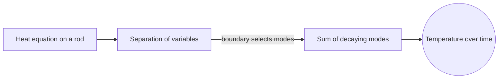

# Partial Differential Equations

## Overview

A partial differential equation, or PDE, involves an unknown function of several variables and its partial derivatives. Because the function depends on more than one variable, often space and time together, a PDE describes how a quantity varies across a region and evolves over time at once. The heat equation, the wave equation, and Laplace's equation are the classic examples, modeling diffusion, vibration, and steady states respectively. Solutions are functions defined over whole regions.

PDEs matter because most field phenomena in physics and engineering are PDEs. Temperature spreading through a plate, sound moving through air, and fluid flowing past a wing are all governed by them. They are much harder than ODEs because change happens in several directions at once and boundary conditions shape the solution everywhere. PDEs are classified as elliptic, parabolic, or hyperbolic, and each type demands different solution methods and behaves differently.

### Quick Takeaways

- A PDE involves several variables and their partial derivatives
- Boundary and initial conditions shape the solution across a region
- Elliptic, parabolic, and hyperbolic types behave and solve differently

## Definition

- **Partial differential equation** relates a multivariable function to its partial derivatives.
- **Order** is the highest partial derivative present in the equation.
- **Boundary condition** fixes the solution on the edges of the region.
- **Initial condition** fixes the solution at a starting time.
- **Elliptic, parabolic, hyperbolic** are the three main classes with distinct behavior.
- **Well-posed problem** has a solution that exists, is unique, and depends smoothly on data.

## The Analogy

Picture a drumhead. Its height at every point changes over time according to the tension and how neighboring points pull on each other. You cannot describe one point without its neighbors, and the rim being fixed shapes the whole vibration. A PDE captures exactly this, a rule linking each point's change to its neighbors and to the boundary. Solving it means finding the shape of the entire drumhead at every instant.

## When You See It

- Modeling heat diffusion through solids
- Describing sound, light, and water waves
- Finding steady-state temperature or potential fields
- Simulating fluid flow with the Navier-Stokes equations
- Pricing derivatives with the Black-Scholes equation
- Analyzing electromagnetic fields in space

## Examples

**Good:** Solving the heat equation on a rod with fixed end temperatures by separation of variables into a sum of decaying modes. The boundary conditions select which modes appear and how fast they fade.

**Bad:** Trying to solve a PDE without specifying boundary or initial conditions. The equation alone allows infinitely many solutions, so the problem is ill-posed and has no single answer.

## Important Points

- PDEs involve change in several directions, making them harder than ODEs
- Boundary and initial conditions are essential to pick a unique solution
- Elliptic equations model steady states, like Laplace's equation
- Parabolic equations model diffusion, like the heat equation
- Hyperbolic equations model waves that carry disturbances at finite speed
- Separation of variables, Fourier methods, and Green's functions are core techniques
- Realistic PDEs usually require numerical methods like finite elements or differences

## Summary

- A PDE involves several variables and their partial derivatives.
- Solutions are functions defined over whole regions.
- Boundary and initial conditions shape and select the solution.
- Elliptic, parabolic, and hyperbolic types behave differently.
- Most practical PDEs need numerical solution methods.
- _A PDE links every point to its neighbors and its boundary at once._
