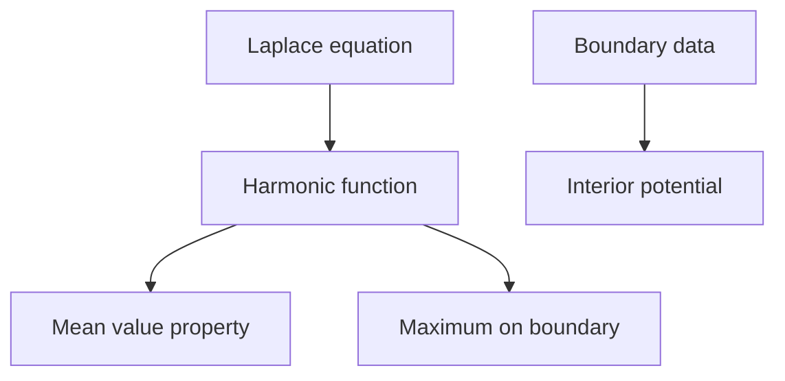
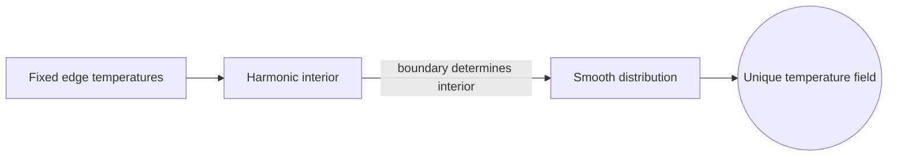

# Potential Theory

## Overview

Potential theory studies potential functions and the harmonic functions that solve Laplace's equation. A harmonic function is one whose value at each point equals the average of its values on any small sphere around that point. This averaging property, called the mean value property, gives harmonic functions remarkable smoothness and rigidity. Potential theory grew out of physics, where the gravitational and electrostatic potentials satisfy exactly these equations in empty space.

It matters because potentials describe fields at rest. The electric potential around charges and the gravitational potential around masses are governed by Laplace's equation where there is no source, and Poisson's equation where there is. The central theme is that harmonic functions cannot have interior peaks or valleys. Their extreme values live on the boundary, which is the maximum principle. This makes boundary data enough to determine the potential everywhere inside.

### Quick Takeaways

- Harmonic functions solve Laplace's equation and satisfy the mean value property
- Their extreme values occur on the boundary, not the interior
- Boundary data determines the potential throughout the region

## Definition

- **Potential** is a scalar function whose gradient gives a force or flow field.
- **Harmonic function** is a solution of Laplace's equation with zero Laplacian.
- **Laplace's equation** sets the sum of second partial derivatives to zero.
- **Poisson's equation** sets the Laplacian equal to a given source term.
- **Mean value property** says a harmonic value equals its spherical average.
- **Maximum principle** says harmonic extremes occur on the boundary.

## The Analogy

Imagine a rubber sheet stretched over a wire frame bent into some shape at the edges. Left alone, the sheet settles into the smoothest possible surface, with no bumps or dips in the middle. Its height at any interior point is the average of the heights around it. That settled sheet is a harmonic function, and the wire frame is the boundary data. Potential theory studies exactly this kind of smoothest settling.

## When You See It

- Computing electrostatic potentials around charge distributions
- Modeling gravitational potentials of mass distributions
- Solving steady-state heat and diffusion problems
- Analyzing incompressible, irrotational fluid flow
- Setting up boundary value problems in physics
- Studying Brownian motion and its exit distributions

## Examples

**Good:** Solving for the temperature inside a plate given fixed edge temperatures, using the fact that steady heat is harmonic. The boundary values determine the smooth interior distribution uniquely.

**Bad:** Expecting a harmonic function to have a local maximum strictly inside its region. The maximum principle forbids this, so any such claim contradicts the theory.

## Important Points

- Harmonic functions have zero Laplacian and satisfy the mean value property
- The maximum and minimum principles force extremes onto the boundary
- Boundary data uniquely determines the harmonic solution inside, the Dirichlet problem
- Poisson's equation adds a source term to model charges or masses
- Green's functions solve these boundary value problems systematically
- Harmonic functions are infinitely smooth despite modest assumptions
- The theory links analysis, physics, and probability through Brownian motion

## Summary

- Potential theory studies potentials and harmonic functions.
- Harmonic functions solve Laplace's equation and average their neighbors.
- Their extreme values live on the boundary by the maximum principle.
- Boundary data determines the interior potential uniquely.
- It describes electrostatic, gravitational, and steady heat fields.
- _A harmonic function is the smoothest surface a boundary can pin down._
