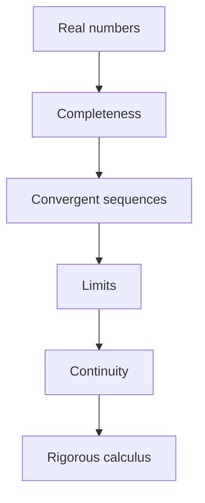

# Real Analysis

## Overview

Real analysis is the rigorous foundation under calculus. It studies real numbers, sequences, series, and real-valued functions with full proof rather than intuition. Where calculus teaches you to compute derivatives and integrals, real analysis proves that those operations make sense, states exactly when they are valid, and builds them from the ground up starting with the properties of the real number line. The epsilon-delta definition of a limit is its central tool.

It matters because intuition about the infinite can mislead. Real analysis reveals surprising functions that are continuous everywhere yet differentiable nowhere, and it clarifies subtle differences like pointwise versus uniform convergence that determine whether you can swap a limit and an integral. The bedrock property is completeness, the fact that the reals have no gaps. Completeness is what guarantees that bounded, well-behaved processes actually converge to real limits.

### Quick Takeaways

- Real analysis proves the foundations of calculus rigorously
- Completeness of the reals guarantees limits exist without gaps
- Subtle distinctions like uniform convergence decide what operations are valid

## Definition

- **Real number line** is the complete, ordered field that has no gaps.
- **Completeness** means every bounded set has a least upper bound.
- **Sequence** is an ordered list of numbers indexed by the naturals.
- **Limit** is the value a sequence or function approaches, defined by epsilon-delta.
- **Uniform convergence** is convergence at one rate across the whole domain.
- **Compactness** is a property letting infinite covers reduce to finite ones.

## The Analogy

Think of building a skyscraper. Calculus is the finished building where people work and get things done. Real analysis is the deep foundation and structural engineering beneath it, the part that proves the building will not collapse. Most users never see the foundation, but every safe floor above depends on it. Real analysis is the careful groundwork that makes all the convenient calculus rules trustworthy.

## When You See It

- Proving that a series converges before summing it
- Justifying swapping limits, sums, and integrals
- Constructing the real numbers from rationals
- Analyzing whether a numerical method truly converges
- Studying pathological functions that defy intuition
- Grounding probability and measure theory rigorously

## Examples

**Good:** Using uniform convergence to justify integrating an infinite series term by term. The uniform bound lets the integral and the sum swap legitimately.

**Bad:** Assuming pointwise convergence always lets you swap a limit and an integral. Counterexamples exist where the swap fails, giving a wrong answer.

## Important Points

- Completeness distinguishes the reals from the rationals and guarantees limits
- The epsilon-delta definition makes closeness precise and provable
- Continuity, differentiability, and integrability are progressively stronger properties
- Uniform convergence, unlike pointwise, preserves continuity and allows limit swaps
- Compact sets are closed and bounded in the reals and tame infinite processes
- Counterexamples like nowhere-differentiable functions mark the limits of intuition
- The Riemann integral is defined and its conditions for existence are proven here

## Summary

- Real analysis is the rigorous foundation of calculus.
- Completeness of the reals guarantees that limits exist.
- Epsilon-delta definitions make closeness precise and provable.
- Uniform convergence and compactness control infinite processes.
- It reveals where intuition about the infinite breaks down.
- _Real analysis is the structural engineering beneath the building of calculus._
