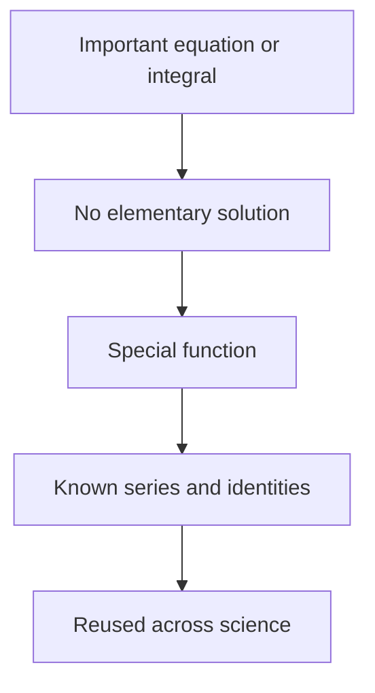
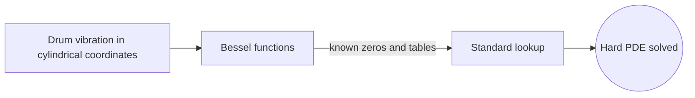

# Special Functions

## Overview

Special functions are a collection of named, well-studied functions that go beyond the elementary ones like polynomials, exponentials, and trigonometric functions. Examples include the gamma function, Bessel functions, Legendre polynomials, and the error function. They earn names because they show up again and again as solutions to important differential equations and integrals across physics, statistics, and engineering, and because their properties have been mapped out in detail.

They matter because many natural problems have no elementary answer, yet their answers recur so often that mathematicians catalogued them once and for all. The gamma function extends the factorial to non-integers. Bessel functions describe vibrations of a drum and waves in cylinders. Rather than resolving the same hard integral repeatedly, scientists recognize a special function and reuse its known series, identities, and tables. The theme is standardizing the useful non-elementary answers.

### Quick Takeaways

- Special functions are named solutions beyond elementary functions
- They recur as answers to important equations and integrals
- Their properties are catalogued once for reuse everywhere

## Definition

- **Special function** is a named non-elementary function with well-studied properties.
- **Gamma function** extends the factorial to real and complex arguments.
- **Bessel function** solves equations with cylindrical symmetry.
- **Legendre polynomial** arises in problems with spherical symmetry.
- **Error function** integrates the Gaussian and appears in probability.
- **Generating function** is a compact series encoding a family of related values.

## The Analogy

Think of a chef's pantry of prepared sauces. Instead of making a complex sauce from scratch every time, the chef reaches for a jar that many cooks have already perfected and labeled. Special functions are that pantry for mathematics. When a hard integral or equation keeps appearing, someone perfects and labels the answer, so everyone afterward just grabs the ready-made function and its known behavior.

## When You See It

- Extending factorials with the gamma function
- Solving wave and heat problems with cylindrical or spherical symmetry
- Computing Gaussian probabilities with the error function
- Expanding potentials in spherical harmonics
- Modeling quantum systems like the hydrogen atom
- Evaluating integrals that resist elementary methods

## Examples

**Good:** Recognizing that a drum vibration problem in cylindrical coordinates is solved by Bessel functions and using their known zeros and tables. The named function turns a hard PDE into a standard lookup.

**Bad:** Trying to force an elementary closed form for the Gaussian integral's antiderivative. It does not exist, so labeling the answer as the error function is the correct move instead.

## Important Points

- Special functions arise where elementary functions cannot express the answer
- The gamma function generalizes the factorial and unifies many formulas
- Bessel and Legendre functions come from symmetry in physical problems
- Each has a rich set of series, recurrences, and integral representations
- Generating functions compactly encode whole families of related values
- Orthogonality of many special functions powers series expansions
- Tables and libraries provide their values, so they behave like standard functions

## Summary

- Special functions are named non-elementary functions with known properties.
- They recur as solutions to important equations and integrals.
- The gamma, Bessel, Legendre, and error functions are key examples.
- Their series, identities, and tables make them reusable tools.
- They standardize the useful answers that elementary functions cannot give.
- _Special functions are the pantry of perfected answers science reaches for again and again._
