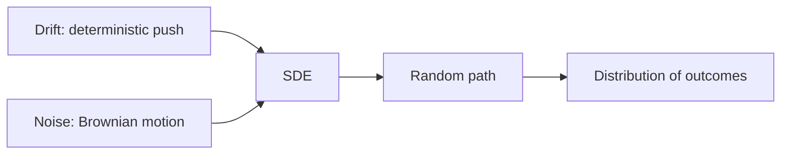
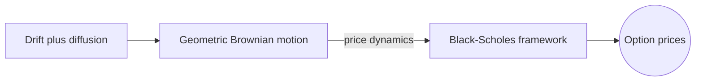
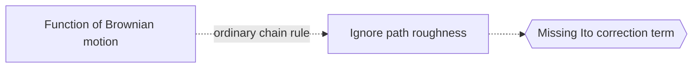

# Stochastic Differential Equations

## Overview

A stochastic differential equation, or SDE, is a differential equation with a random term added. Alongside a deterministic drift that pushes the system in a predictable direction, there is a diffusion term driven by noise, usually Brownian motion. The result is that the solution is not a single curve but a random process. Each run produces a different path, and what you study is the distribution of those paths rather than one exact trajectory.

SDEs matter wherever randomness and continuous change combine. Stock prices, particle motion, and noisy control systems all fit. The key difficulty is that Brownian motion is so jagged that ordinary calculus breaks down. You cannot differentiate it in the usual way. This forced the creation of stochastic calculus, centered on the Ito integral and Ito's lemma, which is the chain rule adapted to noise and carries an extra second-order correction term.

### Quick Takeaways

- An SDE adds random noise to a differential equation
- Solutions are random processes, not single curves
- Stochastic calculus replaces ordinary calculus, with Ito's lemma at its core

## Definition

- **Stochastic differential equation** combines a deterministic drift with a random diffusion term.
- **Drift** is the predictable direction the system tends to move.
- **Diffusion** is the noise-driven, random part of the change.
- **Brownian motion** is the continuous, jagged random process that drives the noise.
- **Ito integral** is the integral against Brownian motion used in stochastic calculus.
- **Ito's lemma** is the chain rule for functions of a stochastic process, with a second-order term.

## The Analogy

Picture a leaf floating down a stream. The current carries it steadily downstream, which is the drift. But tiny swirls and eddies also jostle it randomly side to side, which is the diffusion. Where the leaf ends up is never exactly predictable, yet you can describe the range of likely landing spots. An SDE is the rule for both the steady current and the random jostling acting together on the leaf.

## When You See It

- Modeling stock prices and option pricing in finance
- Describing the random motion of particles in a fluid
- Simulating noisy signals in engineering and control
- Modeling population dynamics with environmental randomness
- Studying thermal fluctuations in physics
- Filtering noisy measurements to estimate a hidden state

## Examples

**Good:** Modeling a stock price with geometric Brownian motion, where drift sets expected growth and diffusion sets volatility. This underlies the Black-Scholes option pricing framework.

**Bad:** Applying the ordinary chain rule to a function of Brownian motion. Brownian paths are too rough for that, so you must use Ito's lemma with its extra correction term.

## Important Points

- The solution is a random process, so you study distributions and averages
- Brownian motion is continuous but nowhere differentiable, breaking ordinary calculus
- The Ito integral defines integration against this rough noise
- Ito's lemma adds a second-order term absent from ordinary calculus
- Drift sets the mean trend while diffusion sets the spread
- Numerical schemes like Euler-Maruyama simulate approximate sample paths
- The Fokker-Planck equation describes how the probability distribution evolves

## Summary

- An SDE adds a random noise term to a differential equation.
- Solutions are random processes described by distributions.
- Drift is the predictable push, diffusion is the random spread.
- Ordinary calculus fails, so stochastic calculus and Ito's lemma apply.
- It models finance, physics, and any noisy continuous system.
- _An SDE steers a system with a steady current and a constant random jostle._
