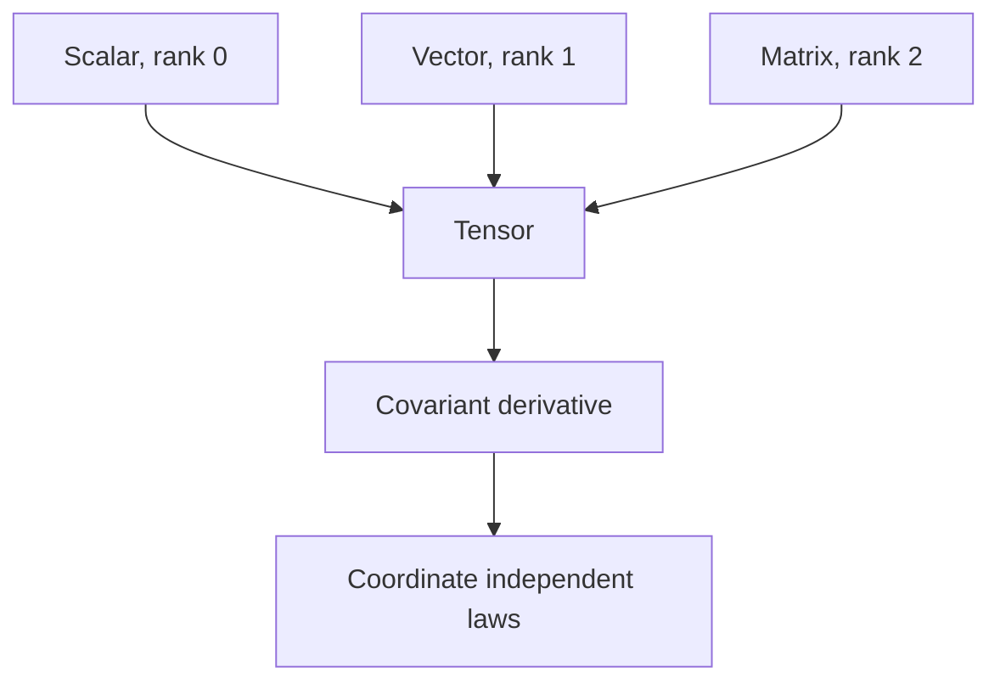
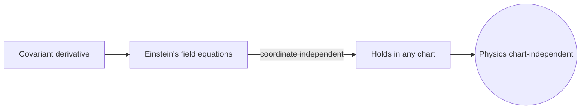
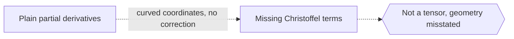

# Tensor Calculus

## Overview

Tensor calculus is the calculus of tensors, which are objects that generalize scalars, vectors, and matrices to any number of indices. A scalar is a tensor of rank zero, a vector rank one, and a matrix rank two. What makes tensors special is how they transform under a change of coordinates. Their components change in a fixed, predictable way so that the underlying geometric or physical object stays the same. Tensor calculus provides derivatives that respect this transformation behavior.

It matters most in physics and geometry, where laws must hold regardless of the coordinate system chosen. General relativity is written entirely in tensor calculus, because gravity is curvature and curvature is a tensor. The central new tool is the covariant derivative, which corrects the ordinary derivative so that differentiating a tensor still gives a tensor. Without this correction, plain derivatives in curved coordinates produce quantities that depend on the arbitrary coordinate choice.

### Quick Takeaways

- Tensors generalize scalars, vectors, and matrices to any rank
- They transform predictably so physical laws stay coordinate independent
- The covariant derivative differentiates tensors while preserving tensor structure

## Definition

- **Tensor** is a multi-indexed object that transforms in a fixed way under coordinate changes.
- **Rank** is the number of indices a tensor carries.
- **Covariant and contravariant** describe the two ways indices transform, as lower and upper.
- **Metric tensor** encodes distances and angles and raises or lowers indices.
- **Covariant derivative** corrects the ordinary derivative to yield a tensor result.
- **Christoffel symbols** are the correction terms that account for curving coordinates.

## The Analogy

Imagine describing the same arrow using different grids, one square and one skewed. The arrow itself never changes, but its listed coordinates differ between grids. A tensor is a rule for how those coordinate lists must change together so everyone agrees on the real arrow. Tensor calculus is the bookkeeping that keeps every observer's numbers consistent, no matter how strangely their grid is drawn.

## When You See It

- Writing the equations of general relativity and gravity
- Describing stress and strain in solid materials
- Formulating electromagnetism in a coordinate-free way
- Doing differential geometry on curved surfaces and manifolds
- Modeling anisotropic material properties in engineering
- Handling curvature and geodesics in curved spaces

## Examples

**Good:** Using the covariant derivative to write Einstein's field equations so they hold in any coordinate system. The tensor form guarantees the physics does not depend on the chart chosen.

**Bad:** Taking plain partial derivatives of vector components in curved coordinates and calling the result a vector. Without the Christoffel correction, the quantity is not a tensor and misstates the geometry.

## Important Points

- Tensors are defined by their transformation rule, not merely by being arrays of numbers
- Upper and lower indices transform oppositely, keeping contractions invariant
- The metric tensor measures lengths and angles and converts between index types
- The covariant derivative adds Christoffel terms so derivatives stay tensorial
- Curvature tensors built from these derivatives measure how space bends
- Einstein summation over repeated indices keeps the notation compact
- Ordinary partial derivatives fail to be tensors except in flat, straight coordinates

## Summary

- Tensor calculus is the calculus of tensors of any rank.
- Tensors transform predictably so laws stay coordinate independent.
- The metric tensor sets distances and raises or lowers indices.
- The covariant derivative differentiates tensors while staying tensorial.
- It is the mathematical language of general relativity and continuum mechanics.
- _Tensor calculus keeps the physics fixed while the coordinates are free to change._
