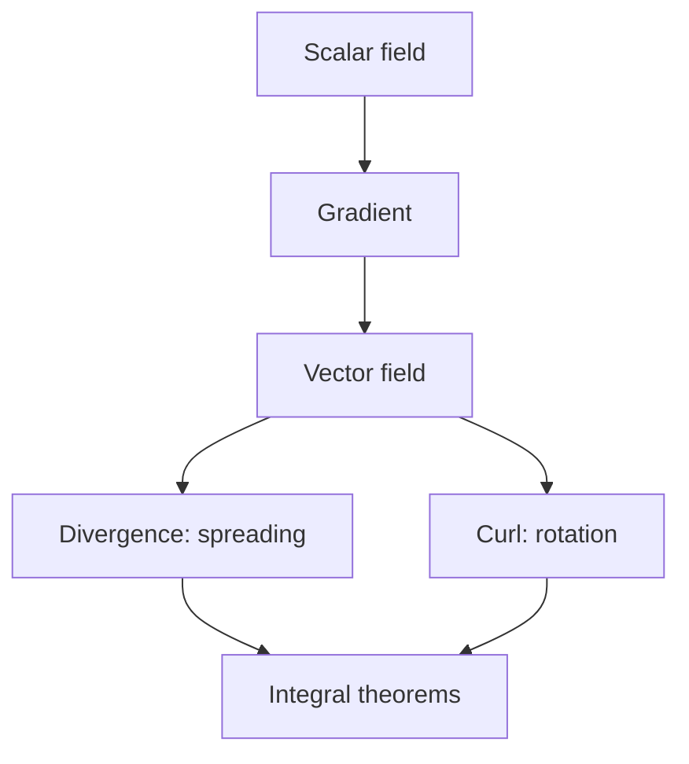

# Vector Calculus

## Overview

Vector calculus studies functions that assign a vector to every point in space, called vector fields, along with scalar fields that assign a number to each point. It builds three key operators. The gradient turns a scalar field into the vector field of steepest ascent. The divergence measures how much a vector field spreads out from a point. The curl measures how much it rotates around a point. These capture the geometry of flow and change in two and three dimensions.

It matters because physics is written in vector fields. Electric and magnetic fields, fluid velocity, and gravitational pull are all vector fields, and their behavior is governed by divergence and curl. The crowning results are the integral theorems, Green's, Stokes', and the divergence theorem, which relate what happens inside a region to what crosses its boundary. They generalize the fundamental theorem of calculus to higher dimensions.

### Quick Takeaways

- Gradient, divergence, and curl describe change in scalar and vector fields
- Divergence measures spreading, curl measures rotation
- Integral theorems link a region's interior to its boundary

## Definition

- **Scalar field** assigns a single number to every point in space.
- **Vector field** assigns a vector to every point in space.
- **Gradient** turns a scalar field into its steepest-ascent vector field.
- **Divergence** measures the net outward flow of a vector field at a point.
- **Curl** measures the local rotation of a vector field at a point.
- **Flux** is the amount of a vector field passing through a surface.

## The Analogy

Picture a river. At each point the water has a speed and direction, which is a vector field. Divergence tells you where water is being added or drained, like a spring or a sinkhole. Curl tells you where the water swirls, like an eddy that would spin a tiny paddle wheel. The gradient is like the slope of the riverbed, pointing uphill. Vector calculus is the toolkit for reading all of this flow at once.

## When You See It

- Describing electric and magnetic fields with Maxwell's equations
- Modeling fluid flow, including sources, sinks, and vortices
- Computing flux of a field through a surface
- Relating boundary circulation to interior curl with Stokes' theorem
- Deriving conservation laws in physics and engineering
- Analyzing heat flow and diffusion across regions

## Examples

**Good:** Using the divergence theorem to convert a hard surface flux integral into an easier volume integral of divergence. The boundary computation becomes an interior one that is simpler to evaluate.

**Bad:** Computing curl on a field defined only along a single line rather than throughout a region. Curl needs neighboring values in all directions, so a one-dimensional slice cannot define it.

## Important Points

- The gradient is perpendicular to level surfaces and points toward steepest ascent
- Divergence is a scalar, positive at sources and negative at sinks
- Curl is a vector describing the axis and strength of local rotation
- A field with zero curl everywhere is conservative and has a scalar potential
- A field with zero divergence everywhere is incompressible, conserving volume of flow
- Green's, Stokes', and the divergence theorem generalize the fundamental theorem of calculus
- These operators are most natural in three dimensions but extend with differential forms

## Summary

- Vector calculus studies scalar and vector fields in space.
- Gradient, divergence, and curl capture ascent, spreading, and rotation.
- Flux measures how much of a field crosses a surface.
- Integral theorems link a region's interior to its boundary.
- It is the language of electromagnetism and fluid dynamics.
- _Vector calculus reads the flow of space through spreading, swirling, and slope._
