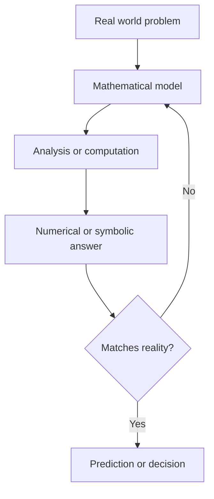

# Applied Mathematics

## Overview

Applied mathematics is the use of mathematical tools to describe and solve real problems. Instead of studying structures for their own sake, it starts from a question in physics, biology, finance, or engineering and reaches for the math that answers it. The work runs both ways. Real problems demand new methods, and existing methods find fresh uses when someone spots the right analogy.

It matters because almost every quantitative field runs on it. Bridges, medicines, weather forecasts, and trading systems all rest on models built from calculus, algebra, probability, and computation. The central tension is fidelity versus tractability. A richer model captures more of reality but becomes harder to solve, so the applied mathematician always trades detail for something you can actually compute.

### Quick Takeaways

- It starts from a real problem and picks the math that fits, not the other way around
- Methods flow across fields, so a technique from physics can solve a finance problem
- The core trade is realism against solvability, richer models cost more to compute

## Definition

- **Applied mathematics** is the branch that develops and uses math to solve problems outside pure theory.
- **Mathematical model** is a set of equations or rules that stand in for a real system.
- **Analytical method** is a technique that produces an exact closed-form answer.
- **Numerical method** is a technique that produces an approximate answer through computation.
- **Validation** is the check that a model's output agrees with observed data.
- **Interdisciplinary transfer** is reusing a method from one field to solve a problem in another.

## The Analogy

Think of a translator who does not just know two languages but also knows the subject being discussed. A pure mathematician invents rich vocabulary. The applied mathematician listens to an engineer describe a vibrating wing, then translates that story into equations, solves them, and translates the answer back into a design change. The value is in the accurate round trip, not in the vocabulary alone.

## When You See It

- Simulating airflow over a car or plane to cut drag before any metal is cut
- Pricing options and managing risk in financial markets with stochastic models
- Modeling how a disease spreads through a population to plan a response
- Reconstructing medical images from raw scanner signals using transforms
- Optimizing a delivery fleet's routes to save fuel and time
- Forecasting weather by solving fluid equations on a global grid

## Examples

**Good:** A team models heat flow in a battery pack with a partial differential equation, solves it numerically, and redesigns the cooling before building a prototype. The model saves months of trial and error.

**Bad:** A team fits a complex nonlinear model to ten noisy data points and trusts its predictions. With so little data the model captures noise, not the real system, and its forecasts mislead.

## Important Points

- Applied math is judged by whether it solves the problem, not by elegance alone
- Every model makes simplifying assumptions, and knowing them is as important as the answer
- The same equation can describe heat, diffusion, and option prices, so structure transfers
- Analytical solutions are exact but rare, so most real work is numerical and approximate
- Data quality caps model quality, since garbage inputs produce confident wrong outputs
- Verification checks the math is solved right, validation checks it is the right math
- Computing power expanded the field, letting models grow far past hand-solvable cases

## Summary

- Applied mathematics turns real problems into math, solves them, and reads results back.
- It spans physics, biology, finance, and engineering, sharing methods across all of them.
- The recurring trade-off is model realism against how hard the model is to solve.
- Numerical methods carry most of the load because exact solutions are uncommon.
- Validation against real data is what separates a useful model from a pretty one.
- _The goal is not beautiful math, it is a right answer to a real question._
