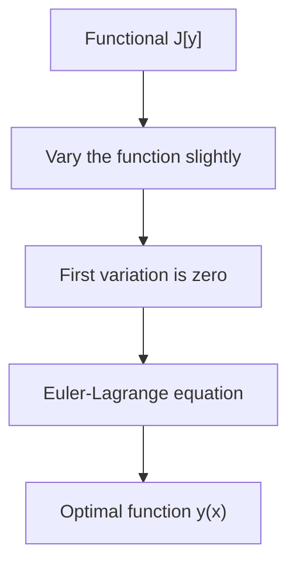

# Calculus of Variations

## Overview

The calculus of variations finds the function that makes some overall quantity as large or small as possible. Ordinary calculus finds the point that minimizes a function. Here the unknown is not a point but a whole function, like the shape of a curve or the path of a particle. The quantity you optimize, called a functional, takes an entire function as input and returns a single number.

It matters because nature and engineering are full of such problems. Light takes the fastest path, a soap film takes the least-area shape, and a hanging chain takes the shape of least energy. The key result is the Euler-Lagrange equation, which turns the search over infinitely many functions into a differential equation you can solve. The tension is that you are optimizing over an infinite-dimensional space, which needs more care than ordinary minimization.

### Quick Takeaways

- The unknown is a whole function, not a single number or point
- A functional maps each candidate function to one number to be optimized
- The Euler-Lagrange equation converts the problem into a differential equation

## Definition

- **Functional** is a rule that maps a function to a single real number.
- **Variation** is a small perturbation of the candidate function.
- **Euler-Lagrange equation** is the differential equation the optimal function must satisfy.
- **Extremal** is a function that makes the functional stationary.
- **Boundary condition** fixes the function's values at the endpoints of the domain.
- **Action** is the specific functional whose minimization gives the laws of physics.

## The Analogy

Imagine choosing the best route down a mountain, but instead of picking waypoints you must commit to an entire trail shape at once. You cannot just check one spot. You have to reason about how the whole path's length or steepness changes if you wiggle it anywhere. The calculus of variations gives the rule for when no small wiggle anywhere can improve the trail, and that is your answer.

## When You See It

- Finding the brachistochrone, the fastest slide between two points under gravity
- Deriving the shape of a soap film, which minimizes surface area
- Formulating physics through the principle of least action
- Finding geodesics, the shortest paths on a curved surface
- Optimal control problems where you shape an input over time
- Image processing that finds smooth curves fitting noisy edges

## Examples

**Good:** Using the Euler-Lagrange equation to prove that the shortest path between two points on a flat plane is a straight line. The method turns intuition into a clean derivation.

**Bad:** Trying to guess the optimal path by testing a handful of shapes by hand. With infinitely many candidates, sampling a few gives no guarantee you found the true extremal.

## Important Points

- The core move is setting the first variation of the functional to zero
- The Euler-Lagrange equation is the infinite-dimensional analog of setting a derivative to zero
- Boundary conditions are essential, since the same functional has different extremals under different ends
- A stationary point can be a minimum, maximum, or saddle, so second-order tests may be needed
- Constraints are handled with Lagrange multipliers, just as in ordinary optimization
- The principle of least action reformulates all of classical mechanics as a variational problem
- Direct methods approximate the optimal function numerically when exact solutions resist

## Summary

- Calculus of variations optimizes a functional over a space of whole functions.
- The Euler-Lagrange equation turns the search into a solvable differential equation.
- Boundary conditions pin down which extremal you actually get.
- Physics, geometry, and engineering all reduce many problems to this framework.
- A stationary functional means no small change to the function can improve it.
- _You are not choosing the best point, you are choosing the best shape of the whole path._
