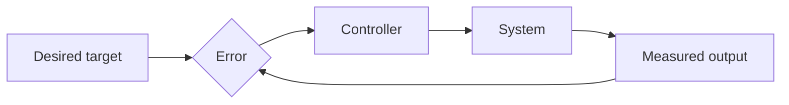

# Control Theory

## Overview

Control theory is the study of how to make a system behave the way you want by choosing its inputs. You have a system with a state that evolves over time, a goal for that state, and knobs you can turn. The theory tells you how to set those knobs, often using feedback that measures the current state and adjusts continuously to close the gap between where you are and where you want to be.

It matters because keeping things stable and on target is a universal need, from thermostats to aircraft autopilots to factory robots. The central idea is feedback. Measuring the output and feeding it back into the input lets a system correct its own errors. The tension is between responsiveness and stability, since a controller that reacts too aggressively can overshoot and oscillate out of control.

### Quick Takeaways

- Feedback measures the current output and adjusts the input to close the error
- The goal is to keep a system stable and tracking a desired target
- Aggressive control reacts fast but risks overshoot and instability

## Definition

- **Plant** is the system being controlled, like a motor or a chemical reactor.
- **Setpoint** is the desired value the output should reach and hold.
- **Feedback** is measuring the output and feeding it back to correct the input.
- **Controller** is the rule that turns the error into a control action.
- **Stability** is the property that outputs stay bounded and do not blow up.
- **PID controller** combines proportional, integral, and derivative terms to drive error to zero.

## The Analogy

Driving a car in your lane is control in action. Your eyes measure how far you have drifted, which is feedback. Your hands turn the wheel in proportion to the drift, which is proportional control. If you oversteer, you weave back and forth across the lane, which is instability. A smooth driver nudges gently and stays centered, exactly what a well-tuned controller does.

## When You See It

- A thermostat cycling a heater to hold a room at the set temperature
- Cruise control adjusting throttle to keep a car at a steady speed uphill and down
- Aircraft autopilots holding altitude and heading against wind gusts
- Robot arms tracking a planned path precisely under changing loads
- Chemical plants regulating temperature, pressure, and flow within safe limits
- Power grids balancing supply and demand to hold frequency steady

## Examples

**Good:** A PID controller on a drone reads its tilt, compares to level, and adjusts motor speeds many times a second. Tuned well, it holds steady hover even in light wind.

**Bad:** Setting the proportional gain far too high on that same drone so it overcorrects every wobble. It oscillates harder each cycle and flips instead of stabilizing.

## Important Points

- Feedback is the core mechanism, letting a system correct its own errors
- Open-loop control sends a fixed input with no correction, fragile to disturbances
- Stability is the first requirement, since an unstable controller is worse than none
- The PID controller is the workhorse, simple and effective across countless systems
- There is always a trade-off between fast response and avoiding overshoot
- Modern control uses state-space models to handle many inputs and outputs at once
- Observability and controllability decide whether you can even sense and steer the state

## Summary

- Control theory steers a system to a target by choosing its inputs.
- Feedback measures the output and corrects the input to shrink the error.
- Stability comes first, because an unstable loop can destroy the system.
- The PID controller is the practical default across most applications.
- Tuning balances quick response against overshoot and oscillation.
- _Measure the gap, nudge to close it, and never push so hard you overshoot._
