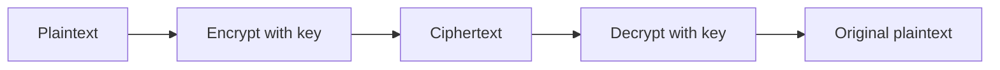
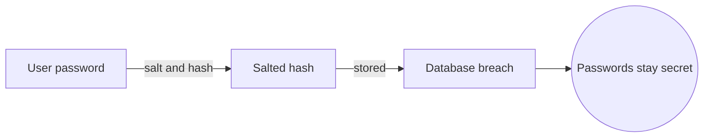
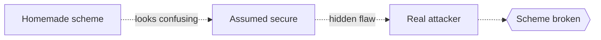

# Cryptography

## Overview

Cryptography is the science of protecting information using mathematical transformations. It scrambles messages so that only someone with the right key can unscramble them, and it builds tools to prove who sent a message and that it was not altered. Its security rests not on hiding the method but on the difficulty of certain mathematical problems.

It matters because every private message, bank transfer, and login depends on it. The foundation is the one-way function, a computation easy to perform but hard to reverse without a secret. Multiplying two large primes is easy, but factoring their product is believed to be very hard. The tension is that security rests on problems being hard, and that assumption can shift as computers, and especially quantum computers, grow more capable.

### Quick Takeaways

- It secures information by making decryption infeasible without the key
- Security depends on certain math problems being hard, not on secret methods
- One-way functions, easy forward and hard to reverse, are the core building block

## Definition

- **Plaintext** is the original readable message.
- **Ciphertext** is the scrambled, unreadable output of encryption.
- **Key** is the secret value that controls encryption and decryption.
- **Symmetric encryption** uses the same key to encrypt and decrypt.
- **Public-key encryption** uses a public key to encrypt and a private key to decrypt.
- **Hash function** maps any input to a fixed-size fingerprint that is hard to reverse.

## The Analogy

Public-key cryptography is like a mailbox with a slot. Anyone can drop a letter through the slot, which is encrypting with the public key, but only the owner with the physical key can open the box and read the letters, which is decrypting with the private key. The slot being open to all does not help a stranger read what is inside.

## When You See It

- HTTPS securing web traffic between your browser and a site
- Messaging apps offering end-to-end encryption of your chats
- Digital signatures proving a software update really came from the vendor
- Password systems storing hashes instead of the passwords themselves
- Cryptocurrencies using signatures and hashes to secure transactions
- Two-factor and certificate systems verifying identity online

## Examples

**Good:** Storing user passwords as salted hashes so a database breach does not reveal the actual passwords. Even the operator cannot read them, and each hash resists reversal.

**Bad:** Inventing a homemade encryption scheme and trusting it because it looks confusing. Untested schemes almost always have flaws, and security by obscurity fails against real attackers.

## Important Points

- Kerckhoffs's principle says security must hold even if the method is public
- One-way functions underpin nearly everything, easy forward and hard to invert
- Symmetric encryption is fast, public-key solves the problem of sharing keys
- Hash functions verify integrity and store fingerprints, but are not encryption
- Never invent your own crypto, use vetted standard algorithms and libraries
- Key management is often the weakest link, not the algorithm itself
- Quantum computers threaten some current schemes, driving post-quantum research

## Summary

- Cryptography secures information through hard mathematical transformations.
- Security rests on the difficulty of problems, not on secret methods.
- One-way functions make encryption easy to do and hard to reverse.
- Symmetric and public-key systems solve different parts of the problem.
- The weakest points are usually key management and homemade schemes.
- _Lock the door with math, but remember the lock is only as safe as the key._
