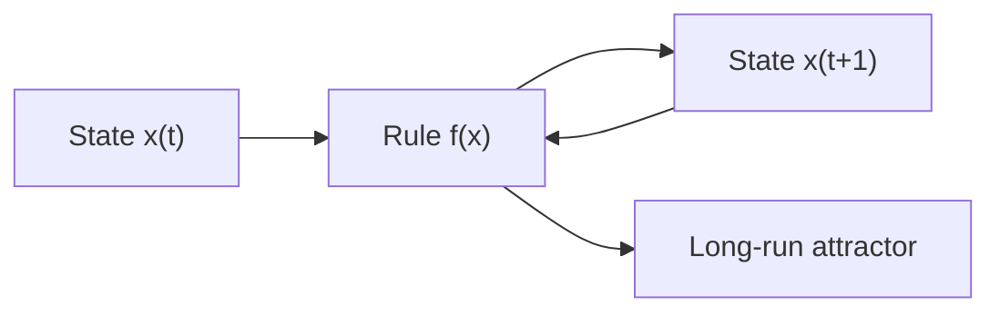

# Dynamical Systems

## Overview

A dynamical system is anything whose state changes over time according to a fixed rule. You describe the current state with numbers, and a rule tells you the next state or the rate of change. Apply the rule repeatedly and you trace out a trajectory through the space of all possible states. The field studies the long-run behavior of these trajectories rather than any single point.

It matters because change is everywhere, from planetary orbits to population swings to heartbeats. The surprise is that simple rules can produce wildly complex behavior. A tiny change in starting conditions can lead to totally different futures, the hallmark of chaos. The tension is between deterministic rules, which fix the future exactly, and practical unpredictability, which makes long forecasts useless.

### Quick Takeaways

- A fixed rule maps the current state to the next, tracing a trajectory over time
- Simple deterministic rules can still produce chaotic, unpredictable behavior
- The field cares about long-run patterns like fixed points, cycles, and attractors

## Definition

- **State** is the full description of the system at one instant.
- **State space** is the set of all possible states the system can occupy.
- **Trajectory** is the path a state traces over time under the rule.
- **Fixed point** is a state the rule maps to itself, so the system stays put.
- **Attractor** is a set of states that nearby trajectories converge toward.
- **Chaos** is sensitive dependence on initial conditions in a deterministic system.

## The Analogy

Picture a marble rolling on a landscape of hills and valleys. Where it goes next depends only on where it is and the shape of the ground, which is the fixed rule. Drop it in a bowl and it settles at the bottom, a fixed point. Set it on a ridge and a hair's difference in start sends it into completely different valleys, which is chaos in miniature.

## When You See It

- Modeling planetary orbits and predicting eclipses centuries ahead
- Population dynamics where predator and prey counts rise and fall in cycles
- Weather systems that are deterministic yet unpredictable past a week or two
- Electrical circuits and control loops that oscillate or settle to steady states
- Studying whether a bridge or aircraft design is stable under small disturbances
- The logistic map showing how a one-line rule slides from order into chaos

## Examples

**Good:** Modeling a pendulum with a differential equation, finding its fixed points, and proving the downward rest point is stable. The analysis explains exactly how the system settles.

**Bad:** Claiming a precise ten-day weather forecast from a chaotic model. Sensitive dependence means tiny measurement errors explode, so the specific forecast is meaningless that far out.

## Important Points

- Determinism does not imply predictability, since chaos amplifies tiny errors fast
- Fixed points and cycles are the skeleton that organizes all nearby behavior
- Stability analysis asks whether small disturbances shrink or grow over time
- Attractors can be points, loops, or strange fractal sets in chaotic systems
- Bifurcations are sudden qualitative shifts as a parameter crosses a threshold
- Continuous systems use differential equations, discrete systems use iterated maps
- The Lyapunov exponent measures how fast nearby trajectories diverge

## Summary

- A dynamical system evolves in time under a fixed rule on its state space.
- The field studies long-run behavior like fixed points, cycles, and attractors.
- Simple deterministic rules can generate genuine chaos and unpredictability.
- Stability analysis tells you whether small perturbations grow or decay.
- Bifurcations mark the thresholds where behavior changes character abruptly.
- _The rule is fixed and knowable, yet the future can still slip beyond reach._
