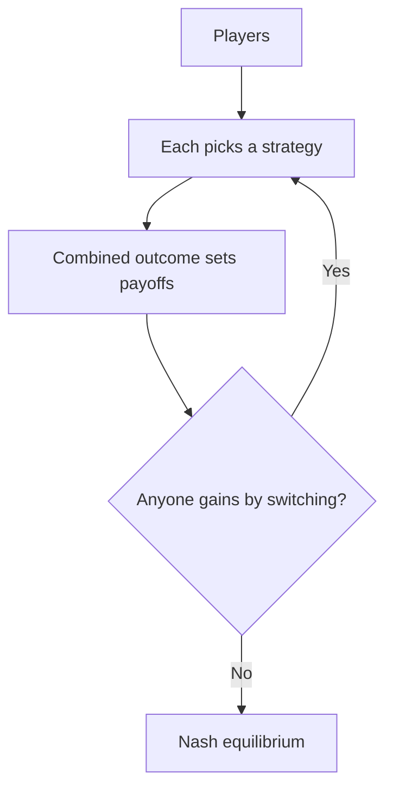
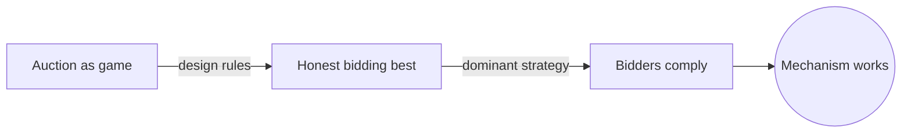
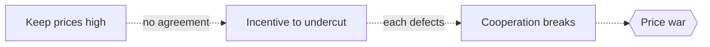

# Game Theory

## Overview

Game theory studies decisions where your payoff depends not only on what you do but on what everyone else does. Each player chooses a strategy, and the combined choices decide the outcome for all. The theory predicts what rational players will do when they know that others are reasoning the same way about them.

It matters because strategic interaction is everywhere, from auctions and pricing to voting, evolution, and international relations. The central concept is the Nash equilibrium, a set of strategies where no player can gain by changing alone. The tension is that individually rational choices can lead to collectively bad outcomes, as the prisoner's dilemma famously shows. What is best for each can be worst for all.

### Quick Takeaways

- Your payoff depends on others' choices, not just your own
- A Nash equilibrium is a stable point where no one gains by deviating alone
- Rational individual choices can produce outcomes that are worse for everyone

## Definition

- **Player** is a decision maker in the game.
- **Strategy** is a complete plan of action a player can choose.
- **Payoff** is the reward a player receives for a given combination of strategies.
- **Nash equilibrium** is a strategy profile where no player benefits from changing alone.
- **Dominant strategy** is one that is best regardless of what others do.
- **Zero-sum game** is one where one player's gain is exactly another's loss.

## The Analogy

Two drivers race toward a one-lane bridge from opposite ends. Each wants to cross first, but if both charge in they crash and both lose. Each driver's best move depends entirely on what the other will do. Game theory is the study of exactly this kind of tangled decision, where you must reason about someone who is reasoning about you.

## When You See It

- Companies deciding whether to cut prices, knowing rivals will react
- Auction design where bidders strategize based on others' likely bids
- Evolutionary biology explaining stable mixes of animal behaviors
- Nations negotiating trade or arms deals under mutual suspicion
- Voting systems where citizens vote strategically, not just sincerely
- Traffic and network routing where each user's choice affects congestion

## Examples

**Good:** Modeling an auction as a game to design rules that make honest bidding each bidder's best strategy. The theory directly shapes a mechanism that works.

**Bad:** Assuming both firms in a price war will cooperate to keep prices high without any binding agreement. Each has incentive to undercut, so the cooperative outcome is unstable and collapses.

## Important Points

- The Nash equilibrium is the anchor, a self-enforcing set of strategies
- A dominant strategy, when it exists, is chosen no matter what others do
- The prisoner's dilemma shows individual rationality can defeat the group
- Mixed strategies randomize choices, and equilibria may exist only in them
- Repeated games allow cooperation to emerge through the shadow of the future
- Zero-sum games have a clean minimax solution, but most real games are not zero-sum
- Mechanism design flips the problem, engineering rules so good behavior is optimal

## Summary

- Game theory analyzes decisions where outcomes depend on everyone's choices.
- The Nash equilibrium is the stable point where no one gains by deviating alone.
- Individually rational choices can lead to collectively poor results.
- Repeated interaction and mechanism design can restore cooperation.
- It applies across economics, biology, politics, and computer science.
- _You cannot plan your move without first imagining theirs about yours._
