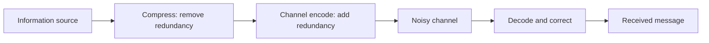
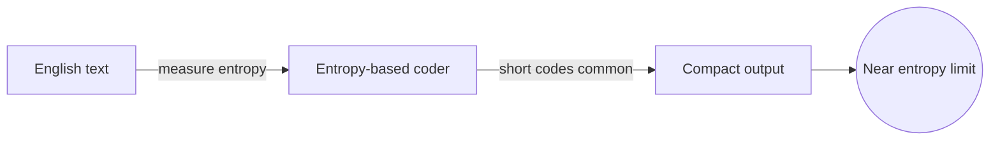
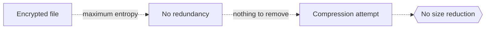

# Information Theory

## Overview

Information theory measures information itself. It answers how much a message actually contains, how far you can compress it without loss, and how fast you can send it reliably over a noisy channel. Claude Shannon founded it by realizing that information equals the reduction of uncertainty, and that this reduction can be measured in bits.

It matters because it sets the hard limits behind all of communication and data storage. The central quantity is entropy, the average uncertainty in a source. It tells you the smallest size a message can be compressed to and the fastest error-free rate a channel allows. The deep tension is between compression, squeezing out redundancy, and error correction, adding redundancy back to survive noise. The theory shows exactly how to balance both.

### Quick Takeaways

- Information is the reduction of uncertainty, measured in bits
- Entropy sets the hard floor on how far data can be compressed
- Channel capacity sets the ceiling on reliable transmission over noise

## Definition

- **Information** is the reduction in uncertainty from learning an outcome.
- **Bit** is the unit of information, the answer to one yes-or-no question.
- **Entropy** is the average uncertainty, or information content, of a source.
- **Channel capacity** is the maximum reliable transmission rate over a channel.
- **Compression** is removing redundancy to shrink a message toward its entropy.
- **Error-correcting code** adds structured redundancy to recover from noise.

## The Analogy

Think of entropy as how surprised you are on average. A message saying "the sun rose today" carries almost no information, since it was certain. A message naming the winner of a close race carries a lot, because the outcome was genuinely uncertain. Information theory measures exactly this surprise, and a message you could have guessed carries few bits.

## When You See It

- File compression formats like ZIP shrinking data toward its entropy
- Error-correcting codes letting phones and satellites work over noisy links
- Data transmission rates limited by Shannon's channel capacity
- Machine learning using cross-entropy as a loss function
- QR codes surviving smudges thanks to built-in redundancy
- Cryptography measuring the randomness, or entropy, of a key

## Examples

**Good:** Compressing English text with an entropy-based coder that gives short codes to common letters and long codes to rare ones. It approaches the theoretical minimum size.

**Bad:** Trying to compress already-random data like an encrypted file and expecting it to shrink. Random data has maximum entropy, so there is no redundancy left to remove.

## Important Points

- Entropy is the fundamental limit, no lossless compression can beat it
- Information is measured in bits, one bit answering one binary question
- Compression removes redundancy, error correction deliberately adds it back
- Shannon's theorem proves reliable communication is possible up to channel capacity
- More probable events carry less information, since they surprise you less
- Cross-entropy connects the theory to machine learning loss functions
- The mutual information measures how much one variable tells you about another

## Summary

- Information theory quantifies information as the reduction of uncertainty.
- Entropy sets the hard floor on how far data can be losslessly compressed.
- Channel capacity sets the ceiling on reliable transmission over noise.
- Compression removes redundancy while error correction adds it back.
- Shannon's results define the fundamental limits of all communication.
- _You can only squeeze out what was predictable, the surprise is the real information._
