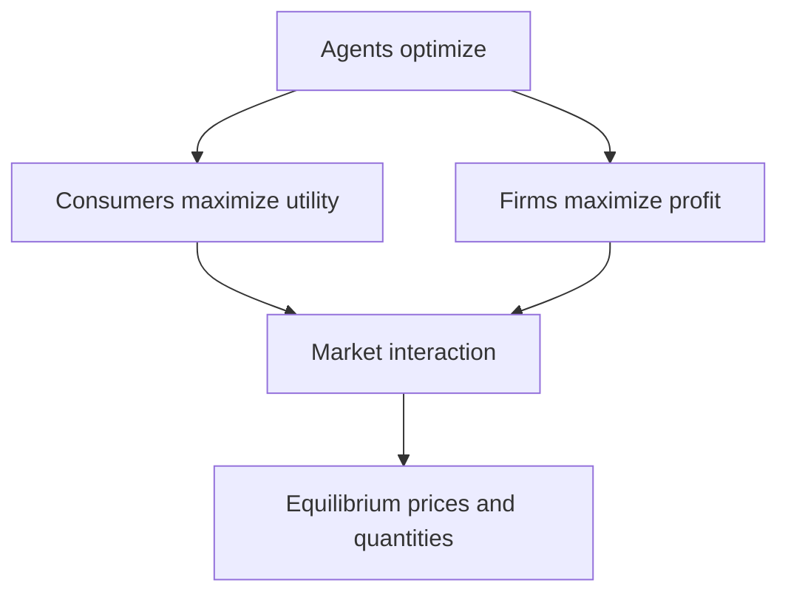
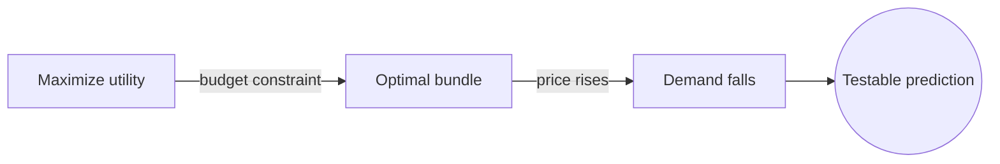
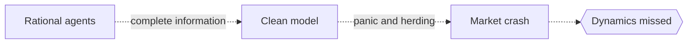

# Mathematical Economics

## Overview

Mathematical economics expresses economic ideas as precise mathematical statements. Instead of arguing in words about supply, demand, and incentives, it writes them as functions, equations, and optimization problems. This makes assumptions explicit, exposes hidden contradictions, and lets economists derive conclusions that follow rigorously from stated premises.

It matters because economic reasoning is full of interacting forces that words handle poorly. When consumers maximize satisfaction and firms maximize profit at the same time, the outcome is an equilibrium that only math can pin down cleanly. The tension is that real people are not the perfectly rational optimizers the models assume, so elegant results can drift from messy reality if the assumptions are pushed too far.

### Quick Takeaways

- Economic ideas become functions, equations, and optimization problems
- Making assumptions explicit exposes contradictions that words can hide
- Equilibrium is the central concept, where competing forces balance

## Definition

- **Utility function** is a mathematical measure of how much satisfaction a choice gives.
- **Equilibrium** is a state where no agent has incentive to change behavior.
- **Constraint** is a limit like a budget that restricts an agent's choices.
- **Marginal analysis** studies the effect of one more unit, using derivatives.
- **Comparative statics** asks how the equilibrium shifts when a parameter changes.
- **General equilibrium** models all markets clearing at once, not one in isolation.

## The Analogy

Think of an economy as a giant tug-of-war with many ropes pulling at once. Consumers pull toward lower prices, firms pull toward higher ones, and supply and demand pull against each other. Words can describe each rope, but only math can compute where the knot finally rests when every force balances. That resting point is the equilibrium.

## When You See It

- Deriving how a tax changes the equilibrium price and quantity in a market
- Modeling a consumer choosing a bundle of goods to maximize utility on a budget
- Studying how firms set output when they compete on price or quantity
- Analyzing labor markets where wages balance supply of workers and demand
- Central banks modeling how interest rate changes ripple through the economy
- Growth models tracking how capital, labor, and technology drive output over time

## Examples

**Good:** Modeling a consumer's choice as maximizing utility subject to a budget constraint, then using it to predict how demand falls when a price rises. The model yields a clear, testable relationship.

**Bad:** Assuming perfectly rational agents with complete information to model a panic-driven market crash. Real behavior there is emotional and herd-driven, so the rational model misses the actual dynamics.

## Important Points

- Making assumptions explicit is the core value, since hidden ones cause bad reasoning
- Optimization under constraints is the workhorse, from consumers to firms
- Equilibrium analysis finds where competing incentives come to rest
- Comparative statics predicts how outcomes shift when conditions change
- Models are only as good as their assumptions about rationality and information
- Behavioral economics adds psychology where the rational model breaks down
- Elegant math can mislead if it is applied outside its assumed conditions

## Summary

- Mathematical economics states economic theories as precise formal models.
- Explicit assumptions expose contradictions that verbal arguments can hide.
- Optimization under constraints models how agents make choices.
- Equilibrium describes where competing incentives balance out.
- The models illuminate structure but depend heavily on their assumptions.
- _Math sharpens the reasoning, but the conclusions are only as sound as the premises._
